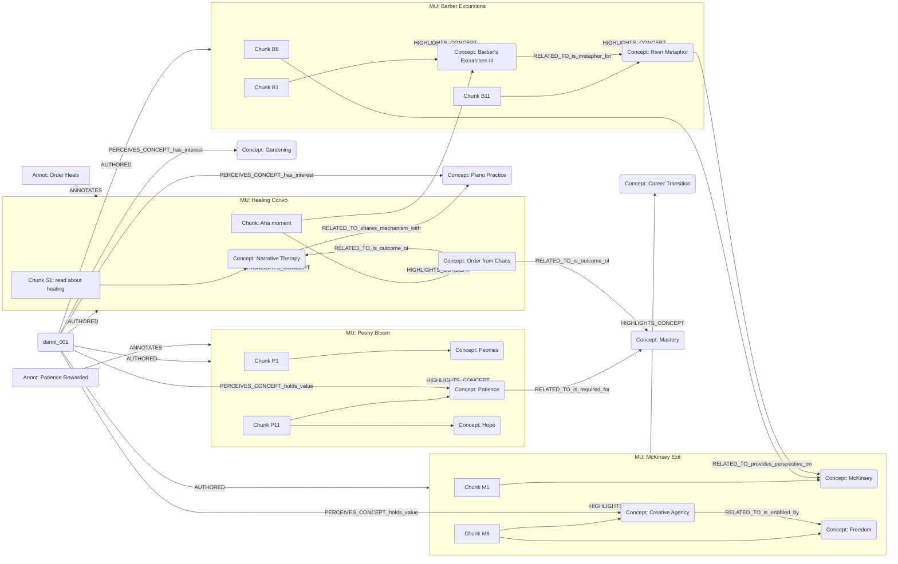

Okay, this is a great challenge. Let's craft an improved design plan for the 2dots1line memory system, addressing the critiques and aiming for a balance of expressiveness, simplicity, scalability, and adaptability.

## Improved Design Plan: 2dots1line Memory & Narrative Engine v2.0

**Core Philosophy:** Simplify the core graph structure by using fewer, more abstract node types and relying on properties and AI-inferred relationships for specificity. Enhance AI agents to manage dynamic interpretation and evolution of memory. Prioritize progressive disclosure of complexity to the user and the system.

**Table of Contents (Conceptual):**
1.  **Simplified Core Knowledge Model**
    1.1. Core Node Types
    1.2. Core Relationship Types
    1.3. Representing the "Four Pillars" (Emergent)
2.  **Dynamic Memory Processing Architecture (Revised Agents)**
    2.1. Agent Roles & Responsibilities (Streamlined)
    2.2. Processing Flow for New Entries & Conversations
3.  **Semantic Layer & Retrieval**
    3.1. Embedding Strategy
    3.2. Hybrid Querying
4.  **Evolution, Re-interpretation & User Interaction**
    4.1. Handling Changing Perspectives
    4.2. User Feedback and Correction
5.  **Illustrative Example: Processing User Entries**
    5.1. Peony Entry
    5.2. McKinsey Exit Entry
    5.3. Barber's Excursions III Entry
    5.4. "Storytelling as Healing" Follow-up
    5.5. Resulting Knowledge Graph Snippet
    5.6. Example User Queries
6.  **Addressing Specific Critiques with this Design**

---

### 1. Simplified Core Knowledge Model

The aim is to reduce the number of distinct node and relationship *labels*, using properties for differentiation.

#### 1.1. Core Node Types

1.  **`User`**:
    *   Properties: `userId` (unique), `name` (optional).
    *   Purpose: The central anchor for a user's entire memory graph.

2.  **`MemoryUnit`**:
    *   Properties: `muid` (unique ID), `creation_ts`, `last_modified_ts`, `source_type` (e.g., "journal_entry", "conversation_log", "fleeting_thought_capture", "imported_note"), `user_title` (optional, user-provided), `ai_title` (optional, AI-generated summary title), `processing_status` (e.g., "raw", "chunked", "structured", "summarized").
    *   Purpose: A container for a distinct "piece" of memory or input. Replaces `Entry`, `DialogueSlice`.

3.  **`Chunk`**:
    *   Properties: `cid` (unique ID), `muid` (links to parent `MemoryUnit`), `text`, `sequence_order` (within `MemoryUnit`), `role` (optional, e.g., "user_utterance", "dot_utterance", "question", "answer_candidate", "key_insight_by_user"), `embedding_vector` (or link to external vector store).
    *   Purpose: Granular, semantically searchable units of text.

4.  **`Concept`**:
    *   Properties: `concept_id` (unique ID, could be a hash of name+type or a UUID), `name` (e.g., "Patience", "McKinsey", "Barber's Excursions III", "Gardening", "Creative Agency"), `type` (e.g., "value", "organization", "person", "topic", "activity", "emotion", "artwork", "life_event_theme", "personal_trait", "goal_theme", "abstract_idea"), `description` (optional, AI-generated definition or user note), `user_defined` (boolean).
    *   Purpose: A generalized node for any significant entity, theme, value, trait, emotion, topic, or abstract idea. This is the backbone of thematic connection. *Replaces many specific node types like `Value`, `Interest`, `Emotion`, `MusicPiece`, `DefiningMoment` (as a label), etc.*

5.  **`Annotation`**:
    *   Properties: `aid` (unique ID), `target_id` (ID of `MemoryUnit` or `Chunk` or `Concept` being annotated), `annotation_type` (e.g., "user_reflection", "ai_inferred_significance", "user_emotion_tag", "link_explanation"), `text_content`, `creation_ts`, `source` ("user" or "ai_agent_X").
    *   Purpose: Allows for adding layers of interpretation, reflections, or metadata without altering the original `Chunk` or `MemoryUnit` text. This supports evolving understanding.

#### 1.2. Core Relationship Types

1.  `(User)-[:AUTHORED]->(MemoryUnit)`
2.  `(MemoryUnit)-[:CONTAINS_CHUNK]->(Chunk)`
3.  `(MemoryUnit)-[:HIGHLIGHTS_CONCEPT {weight: float, significance: string}]->(Concept)` (AI or user-assigned weight/significance)
4.  `(Chunk)-[:MENTIONS_CONCEPT {weight: float}]->(Concept)` (AI-assigned weight based on relevance)
5.  `(Concept)-[:RELATED_TO {relationship_label: string, weight: float, source: string}]->(Concept)`
    *   `relationship_label` examples: "is_a_type_of", "is_part_of", "causes", "influences", "is_exemplified_by", "is_opposite_of", "is_goal_for_value". This captures rich semantic links.
    *   `source` examples: "ai_inferred_cooccurrence", "user_stated_connection", "ontological_definition".
6.  `(User)-[:PERCEIVES_CONCEPT {type: string, current_salience: float, start_date: date, end_date: date}]->(Concept)`
    *   This is key for the "SELF" model. `type` examples: "holds_value", "has_interest", "possesses_skill", "experiences_struggle", "pursues_goal". `current_salience` indicates current importance. `start_date`/`end_date` allow for temporal tracking of these perceptions.
7.  `(MemoryUnit_A)-[:SEQUEL_TO / :PRECEDES / :ELABORATES_ON {reason: string}]->(MemoryUnit_B)` (To link related entries or conversational turns over time)
8.  `(Annotation)-[:ANNOTATES]->(MemoryUnit | Chunk | Concept)`

#### 1.3. Representing the "Four Pillars" (Emergent)

The four pillars (SELF, LIFE EVENTS, RELATIONSHIPS, FUTURE ORIENTATION) are not explicit top-level graph structures but rather *emergent perspectives or queries* on the graph:

*   **SELF:** Queried via `(User)-[:PERCEIVES_CONCEPT]->(Concept)` where `Concept.type` is "value", "personal_trait", "skill", "interest", "struggle". Associated `MemoryUnit`s provide context.
*   **LIFE EVENTS:** `MemoryUnit`s where `(MemoryUnit)-[:HIGHLIGHTS_CONCEPT]->(Concept)` and `Concept.type` is "life_event_theme" (e.g., "Career Transition," "Personal Achievement," "Health Challenge"). The `significance` property on the relationship or `Annotation`s can further qualify them (e.g., "defining_moment_significance").
*   **RELATIONSHIPS:** `Concept` nodes with `type: "person"` or `type: "group"`. `MemoryUnit`s mentioning these concepts, and `Annotation`s describing relationship dynamics.
*   **FUTURE ORIENTATION:** `(User)-[:PERCEIVES_CONCEPT]->(Concept)` where `Concept.type` is "goal_theme" or "aspiration_theme". `Concept` nodes with `type: "future_concern"`.

---

### 2. Dynamic Memory Processing Architecture (Revised Agents)

The agent pipeline is streamlined.

#### 2.1. Agent Roles & Responsibilities (Streamlined)

1.  **`Ingestion & Primary Processing Agent` (IPPA):**
    *   **Responsibilities:**
        *   Listens to user input (chat, journal entry, etc.).
        *   Decides if input is memory-worthy ("capture decision").
        *   Creates `MemoryUnit` (status: "raw").
        *   Chunks `MemoryUnit` text into `Chunk` nodes, assigns `sequence_order`.
        *   Performs basic `Concept` extraction (NER for people, places, orgs, dates; keywords) for each `Chunk` and creates/links placeholder `Concept` nodes (`MENTIONS_CONCEPT` rel).
        *   Calculates embeddings for `Chunk`s.
        *   For conversational input, identifies `Chunk.role` (user/dot utterance).
    *   **Triggers:** On every new user input.
    *   **LLM Use:** Minimal, for capture decision and very basic NER/keyword if not using off-the-shelf tools.

2.  **`Contextual Structuring & Enrichment Agent` (CSEA):**
    *   **Responsibilities:**
        *   Periodically processes `MemoryUnit`s with status "raw" or those flagged for re-evaluation.
        *   **Deep Concept Analysis:** Refines `Concept` extraction from `MemoryUnit`s and `Chunk`s. Identifies more abstract concepts (themes, values, emotions hinted at). Updates `Concept` nodes (adds type, description if missing). Creates `HIGHLIGHTS_CONCEPT` relationships from `MemoryUnit` to `Concept`s.
        *   **Relationship Inference:** Infers `RELATED_TO` relationships between `Concept`s based on co-occurrence within/across `MemoryUnit`s, semantic similarity, or explicit user statements within the text.
        *   **SELF Model Update:** Based on `MemoryUnit` content, updates `(User)-[:PERCEIVES_CONCEPT]->(Concept)` relationships (e.g., infers a new value or interest, or a change in salience of an existing one).
        *   **Conversational Arc Recognition:** For `MemoryUnit.source_type = "conversation_log"`, identifies Q&A patterns, key insights. Populates `Chunk.role` more deeply (question, key_exploration_point, user_conclusion). May create `Annotation`s summarizing the conversational outcome.
        *   **Significance Assessment:** Creates `Annotation`s of type "ai_inferred_significance" for `MemoryUnit`s or key `Chunk`s.
        *   Updates `MemoryUnit.processing_status` to "structured".
    *   **Triggers:** Periodically (e.g., end of session, nightly batch), or when a `MemoryUnit` is explicitly marked for deeper analysis by the user or IPPA.
    *   **LLM Use:** Significant. This is the main "sense-making" agent.

3.  **`Retrieval & Synthesis Agent` (RSA):**
    *   **Responsibilities:**
        *   Handles user queries that require information retrieval or narrative generation.
        *   Uses hybrid search: vector search on `Chunk` embeddings + graph traversal on the structured KG.
        *   Synthesizes information from retrieved `Chunk`s, `Concept`s, `MemoryUnit`s, and `Annotation`s to answer questions or generate narratives (e.g., Moth story, daily reflection prompts, thematic summaries).
        *   Can create temporary `Annotation`s or `MemoryUnit`s (status: "ephemeral_synthesis") to present complex answers.
    *   **Triggers:** On user query requiring retrieval/synthesis.
    *   **LLM Use:** Significant for natural language understanding of query and generation of response.

4.  **`User Feedback & Annotation Agent` (UFAA):**
    *   **Responsibilities:**
        *   Provides UI hooks for users to add `Annotation`s (reflections, emotion tags, corrections).
        *   Allows users to explicitly create/link `Concept`s or confirm/reject AI-inferred `Concept` relationships or `PERCEIVES_CONCEPT` links.
        *   User corrections can flag relevant `MemoryUnit`s for re-processing by CSEA.
    *   **Triggers:** User interaction with the UI.
    *   **LLM Use:** Minimal; primarily a CRUD interface to `Annotation`s and explicit graph edits.

#### 2.2. Processing Flow for New Entries & Conversations

1.  User provides input (e.g., journal entry or chat message).
2.  **IPPA** captures it, creates `MemoryUnit` (status: "raw"), `Chunk`s it, does basic `Concept` tagging, embeds `Chunk`s.
    *   If chat, Dot (RSA) might provide an immediate contextual reply based on very recent `Chunk`s or a quick vector search.
3.  Later (e.g., end of session), **CSEA** picks up the "raw" `MemoryUnit`.
    *   Performs deep analysis: refines concepts, infers relationships between concepts, updates user's SELF model (`PERCEIVES_CONCEPT`), identifies conversational structure/insights.
    *   Adds `Annotation`s (e.g., inferred significance).
    *   Updates `MemoryUnit.processing_status` to "structured."
4.  User queries "Dot, what did I learn about X?"
5.  **RSA** receives query.
    *   Embeds query, performs vector search on `Chunk`s.
    *   Uses retrieved `Chunk` IDs to find parent `MemoryUnit`s and associated `Concept`s, `Annotation`s in the graph.
    *   Synthesizes an answer using the LLM, drawing from this contextualized data.
6.  User reflects on a `MemoryUnit` via UI.
7.  **UFAA** creates an `Annotation` node linked to the `MemoryUnit`. This new `Annotation` might trigger CSEA to re-evaluate related concepts.

---

### 3. Semantic Layer & Retrieval

#### 3.1. Embedding Strategy

*   Embeddings are primarily created for `Chunk.text`.
*   Optionally, `Concept.description` and `Annotation.text_content` (especially AI-generated summaries or user reflections) can also be embedded to allow semantic search over these higher-level constructs.
*   Embeddings are stored in a dedicated vector database (e.g., Weaviate, Pinecone) indexed by `cid` (or `concept_id`, `aid`).

#### 3.2. Hybrid Querying

RSA combines:
1.  **Vector Search:** For semantic similarity on user's natural language query against `Chunk` (and optionally `Concept`/`Annotation`) embeddings. Returns top-K relevant `Chunk` IDs.
2.  **Graph Expansion & Filtering:** Uses the retrieved `Chunk` IDs to:
    *   Fetch full `Chunk` text and parent `MemoryUnit` details.
    *   Traverse to linked `Concept`s (`MENTIONS_CONCEPT`, `HIGHLIGHTS_CONCEPT`).
    *   Explore `RELATED_TO` relationships between these `Concept`s.
    *   Access related `Annotation`s.
    *   Filter by `MemoryUnit.creation_ts`, `Concept.type`, etc.
3.  **LLM Synthesis:** The retrieved, contextualized data bundle is passed to an LLM to generate a coherent answer or narrative.

---

### 4. Evolution, Re-interpretation & User Interaction

#### 4.1. Handling Changing Perspectives

*   **`Annotation`s are Key:** New insights or reinterpretations by the user are captured as new `Annotation`s targeting older `MemoryUnit`s, `Chunk`s, or `Concept`s. This preserves the original memory while layering new understanding on top.
*   **Temporal `PERCEIVES_CONCEPT`:** The `(User)-[:PERCEIVES_CONCEPT {start_date, end_date}]->(Concept)` relationship allows tracking changes in values, interests, goals over time. CSEA can infer these changes based on new `MemoryUnit`s.
*   **Re-processing by CSEA:** Significant new `Annotation`s or explicit user feedback can trigger CSEA to re-evaluate a `MemoryUnit` or a set of related `Concept`s, potentially leading to new `RELATED_TO` links or updates to the user's SELF model. The original `Chunk`s remain immutable, but their interpretation (via links and annotations) evolves.

#### 4.2. User Feedback and Correction

*   UFAA provides interfaces for:
    *   Correcting `Concept.type` or `Concept.name`.
    *   Confirming or rejecting AI-inferred `RELATED_TO` links between `Concept`s.
    *   Adjusting `PERCEIVES_CONCEPT` links (e.g., "This is no longer a primary value for me").
    *   Adding custom `Annotation`s with their own interpretation.
*   These actions directly modify the graph or create `Annotation`s that inform future CSEA processing.

---

### 5. Illustrative Example: Processing User Entries

Let's trace how the provided entries would be processed.

**User:** Danni (`userId: "danni_001"`)

#### 5.1. Peony Entry

"This morning, I checked on my peonies again. It finally bloomed into this gorgeous crimson-dark rose color dotted with gold. ... But I love mine, because it rewarded patience with early hope."

1.  **IPPA:**
    *   Capture decision: KEEP.
    *   Creates `MemoryUnit` (`muid: "mu_peony_01"`, `source_type: "journal_entry"`, `user_title: "Peony Bloom"`, `status: "raw"`).
    *   Creates `Chunk`s (P1-P11 from earlier example), each linked to `mu_peony_01` via `CONTAINS_CHUNK`. `sequence_order` set.
    *   Basic `Concept` extraction:
        *   P1: `(Chunk:P1)-[:MENTIONS_CONCEPT]->(Concept {name:"Peonies", type:"plant"})`
        *   P11: `(Chunk:P11)-[:MENTIONS_CONCEPT]->(Concept {name:"Patience", type:"abstract_idea"})`, `(Chunk:P11)-[:MENTIONS_CONCEPT]->(Concept {name:"Hope", type:"emotion"})`
    *   Embeds P1-P11.

2.  **CSEA (later):**
    *   Processes `mu_peony_01`.
    *   **Deep Concept Analysis:**
        *   Confirms/refines `Concept:Peonies` (type: "activity" or "topic" related to gardening).
        *   Promotes `Concept:Patience` to `type: "value"`.
        *   Promotes `Concept:Hope` to `type: "emotion"`.
        *   Identifies `Concept:Gardening` (type: "activity").
        *   Identifies `Concept:Pleasant Surprise` (type: "emotion").
        *   Identifies `Concept:Appreciation for Subtle Beauty` (type: "value" or "personal_trait", from "I love mine...gorgeous crimson-dark").
    *   **`HIGHLIGHTS_CONCEPT` links:**
        *   `(mu_peony_01)-[:HIGHLIGHTS_CONCEPT {weight:0.9, significance:"key_theme"}]->(Concept:Patience)`
        *   `(mu_peony_01)-[:HIGHLIGHTS_CONCEPT {weight:0.8}]->(Concept:Hope)`
        *   `(mu_peony_01)-[:HIGHLIGHTS_CONCEPT {weight:0.7}]->(Concept:Gardening)`
    *   **SELF Model Update:**
        *   `(User:danni_001)-[:PERCEIVES_CONCEPT {type:"holds_value", current_salience:0.8, start_date:entry_date}]->(Concept:Patience)`
        *   `(User:danni_001)-[:PERCEIVES_CONCEPT {type:"has_interest", current_salience:0.7, start_date:entry_date}]->(Concept:Gardening)`
    *   **`Annotation`s:**
        *   `(:Annotation {annotation_type:"ai_inferred_significance", text_content:"Entry reflects on the reward of long-term patience in a personal project."})-[:ANNOTATES]->(mu_peony_01)`
    *   `mu_peony_01.status` -> "structured".

#### 5.2. McKinsey Exit Entry

"I just left McKinsey where I have worked for 12 years. ... I deserve to treat myself as client for once..."

1.  **IPPA:**
    *   Creates `MemoryUnit` (`muid: "mu_mck_exit_01"`, `source_type: "journal_entry"`, `status: "raw"`).
    *   Creates `Chunk`s (M1-M10).
    *   Basic `Concept` extraction: `McKinsey` (org), `Creative Agency` (abstract_idea), `Freedom` (abstract_idea), `AI video coding` (topic/skill).
    *   Embeds M1-M10.

2.  **CSEA (later):**
    *   Processes `mu_mck_exit_01`.
    *   **Deep Concept Analysis:**
        *   `Concept:McKinsey` (type: "organization", also "past_employment_experience").
        *   `Concept:Creative Agency` (type: "value").
        *   `Concept:Freedom` (type: "value").
        *   `Concept:Self-Authorship` (type: "value", from "job I want...needs to be created by myself").
        *   `Concept:AI video coding` (type: "skill" or "activity").
        *   `Concept:Career Transition` (type: "life_event_theme").
        *   `Concept:Empowerment` (type: "emotion").
    *   **`HIGHLIGHTS_CONCEPT` links:**
        *   `(mu_mck_exit_01)-[:HIGHLIGHTS_CONCEPT {significance:"defining_moment_theme"}]->(Concept:Career Transition)`
        *   `(mu_mck_exit_01)-[:HIGHLIGHTS_CONCEPT {significance:"key_value_realization"}]->(Concept:Creative Agency)`
    *   **SELF Model Update:**
        *   `(User:danni_001)-[:PERCEIVES_CONCEPT {type:"holds_value", current_salience:0.9}]->(Concept:Creative Agency)`
        *   `(User:danni_001)-[:PERCEIVES_CONCEPT {type:"holds_value", current_salience:0.9}]->(Concept:Freedom)`
        *   `(User:danni_001)-[:PERCEIVES_CONCEPT {type:"possesses_skill"}]->(Concept:AI video coding)`
    *   **`RELATED_TO` Inference:**
        *   `(Concept:Creative Agency)-[:RELATED_TO {relationship_label:"is_enabled_by"}]->(Concept:Freedom)`
    *   `mu_mck_exit_01.status` -> "structured".

#### 5.3. Barber's Excursions III Entry

"Lately, I have been practicing Barber's Excursions III. ... the river is my life and McKinsey has been part of the bank..."

1.  **IPPA:** (Similar process for `muid: "mu_barber_01"`, Chunks B1-B11, basic concepts: "Barber's Excursions III", "McKinsey", "River metaphor")

2.  **CSEA (later):**
    *   Processes `mu_barber_01`.
    *   **Deep Concept Analysis:**
        *   `Concept:Barber's Excursions III` (type: "artwork", sub-type: "music_piece").
        *   `Concept:Piano Practice` (type: "activity").
        *   `Concept:Flow` (type: "emotion" / "state_of_being").
        *   `Concept:Mastery` (type: "value" / "goal_theme").
        *   `Concept:River Metaphor for Life` (type: "abstract_idea" / "personal_philosophy").
        *   `Concept:Resolution` (type: "emotion").
    *   **`HIGHLIGHTS_CONCEPT` links:**
        *   `(mu_barber_01)-[:HIGHLIGHTS_CONCEPT]->(Concept:Barber's Excursions III)`
        *   `(mu_barber_01)-[:HIGHLIGHTS_CONCEPT]->(Concept:River Metaphor for Life)`
    *   **SELF Model Update:**
        *   `(User:danni_001)-[:PERCEIVES_CONCEPT {type:"has_interest"}]->(Concept:Piano Practice)`
        *   `(User:danni_001)-[:PERCEIVES_CONCEPT {type:"holds_value"}]->(Concept:Flow)`
    *   **`RELATED_TO` Inference (crucial here):**
        *   `(Concept:Barber's Excursions III)-[:RELATED_TO {relationship_label:"is_metaphor_for", weight:0.9}]->(Concept:River Metaphor for Life)` (from B4, B11)
        *   `(Concept:River Metaphor for Life)-[:RELATED_TO {relationship_label:"provides_perspective_on"}]->(Concept:McKinsey)` (from B11 - McKinsey as riverbank)
        *   `(Concept:Piano Practice)-[:RELATED_TO {relationship_label:"can_lead_to"}]->(Concept:Flow)` (from B6)
        *   `(Concept:Patience)-[:RELATED_TO {relationship_label:"is_required_for"}]->(Concept:Mastery)` (linking to existing Patience concept)
    *   `mu_barber_01.status` -> "structured".

#### 5.4. "Storytelling as Healing" Follow-up

User: "Today I read a sentence that sharing an emotional story with an audience can be healing... Why do I feel this way?"
Dot: (encourages exploration)
User (Aha): "Yes! When the hands finally align... my chest actually loosens... Bringing order to the music and the story stops the swirl..."

1.  **IPPA:**
    *   Captures this conversation as a new `MemoryUnit` (`muid: "mu_healing_convo_01"`, `source_type: "conversation_log"`, `status: "raw"`).
    *   Chunks the turns. User utterances get `role: "user_utterance"`, Dot's get `role: "dot_utterance"`.
    *   Basic concepts: "Storytelling", "Healing", "Barber's Excursions III", "Order".

2.  **CSEA (later):**
    *   Processes `mu_healing_convo_01`.
    *   **Conversational Arc Recognition:**
        *   Identifies the user's initial question chunk (S5 from earlier example) and assigns `role: "question"`.
        *   Identifies the "Aha" moment chunk and assigns `role: "key_insight_by_user"`.
    *   **Deep Concept Analysis:**
        *   `Concept:Narrative Therapy` (type: "abstract_idea" or "topic", from "sharing emotional story...healing").
        *   `Concept:Order from Chaos` (type: "abstract_idea" / "psychological_process").
    *   **`RELATED_TO` Inference:**
        *   `(Concept:Narrative Therapy)-[:RELATED_TO {relationship_label:"shares_mechanism_with"}]->(Concept:Piano Practice)` (specifically practice of Barber's Excursions III, as per user insight)
        *   `(Concept:Order from Chaos)-[:RELATED_TO {relationship_label:"is_outcome_of"}]->(Concept:Narrative Therapy)`
        *   `(Concept:Order from Chaos)-[:RELATED_TO {relationship_label:"is_outcome_of"}]->(Concept:Mastery)` (in context of piano)
        *   `(Concept:Barber's Excursions III)-[:RELATED_TO {relationship_label:"is_example_of_achieving"}]->(Concept:Order from Chaos)`
    *   **Annotation:** CSEA might create an `Annotation` on `mu_healing_convo_01`: `(:Annotation {annotation_type:"ai_summary_of_insight", text_content:"User realizes that both musical mastery (Barber) and narrative construction provide healing by creating order from emotional/cognitive complexity, leading to a sense of relief."})`
    *   `mu_healing_convo_01.status` -> "structured".

#### 5.5. Resulting Knowledge Graph Snippet (Conceptual)


*(Note: Mermaid diagram is a simplification; actual graph has more chunk-concept links, weights, properties etc.)*

#### 5.6. Example User Queries (Answered by RSA)

1.  **"Dot, what's the connection I made between my piano playing and leaving McKinsey?"**
    *   RSA: Vector search hits chunks from `mu_barber_01` (B8, B11) and `mu_healing_convo_01` (S_Aha).
    *   Graph traversal:
        *   `Chunk:B8` -> `MENTIONS_CONCEPT` -> `Concept:McKinsey` & `Concept:Barber's Excursions III`.
        *   `Chunk:S_Aha` -> `MENTIONS_CONCEPT` -> `Concept:Barber's Excursions III` & `Concept:Order from Chaos`.
        *   Follow `RELATED_TO` from `Concept:Barber's Excursions III` -> `Concept:River Metaphor for Life` -> `Concept:McKinsey`.
        *   Follow `RELATED_TO` from `Concept:Barber's Excursions III` -> `Concept:Order from Chaos`.
    *   LLM Synthesis: "You've reflected on how practicing Barber's Excursions III, with its challenge of bringing order to complex rhythms, mirrors both your career journey at McKinsey—which you described as a riverbank shaping your life's flow—and a broader theme of finding healing by creating order. You realized that mastering the music, like constructing a narrative, helps stop emotional 'swirl' and feels grounding, much like navigating the complexities of your career transition."

2.  **"How has my understanding of 'patience' shown up recently?"**
    *   RSA: Vector search + graph query for `(User)-[:PERCEIVES_CONCEPT]->(Concept {name:"Patience"})` and then find `MemoryUnit`s that `HIGHLIGHTS_CONCEPT` -> `(Concept:Patience)`.
    *   Retrieves `mu_peony_01`.
    *   LLM Synthesis: "Recently, your experience with the peonies beautifully illustrated patience. You noted how after three years of waiting and not setting high expectations, the bloom was a 'pleasant surprise' that 'rewarded patience with early hope.' This connects to the idea of long-term effort leading to satisfying outcomes."

3.  **"Generate a Moth story about finding agency."**
    *   RSA:
        *   Identifies `Concept:Creative Agency` as key. Finds `(User)-[:PERCEIVES_CONCEPT {type:"holds_value"}]->(Concept:Creative Agency)`.
        *   Finds `MemoryUnit`s strongly highlighting this: `mu_mck_exit_01` and related `mu_barber_01` (agency in mastering music).
        *   Pulls relevant `Chunk`s, `Annotation`s, and related `Concept`s (Freedom, Self-Authorship, Mastery).
    *   LLM Synthesis: (Generates a story similar to the original example, weaving these elements).

---

### 6. Addressing Specific Critiques with this Design

1.  **KG Schema Complexity:** Drastically reduced core node/relationship labels. Specificity moved to `Concept.type`, `Concept.name`, `relationship_label` properties, and `Annotation`s. Queries become more about property filtering and path patterns than myriad label combinations.
2.  **Agent Orchestration:** Simplified to fewer, more powerful agents. CSEA acts as the main "sense-making" batch processor, reducing complex real-time inter-dependencies. `MemoryUnit.processing_status` helps manage flow.
3.  **User Burden vs. AI Inference:** IPPA does light lifting. CSEA does heavy AI inference, but its output (new concepts, relationships) can be surfaced to the user via UFAA for validation/correction over time. The system can function with basic IPPA output and progressively enriches.
4.  **Scalability of "Everyday Subtleties":** All inputs become `MemoryUnit`s and `Chunk`s. However, CSEA's periodic processing can prioritize `MemoryUnit`s based on initial IPPA flags, user interaction, or if they contain high-signal `Chunk`s. Very minor "fleeting thoughts" might remain as `MemoryUnit`s with minimal `Concept` links unless they gain significance later through connection or user annotation. The `Annotation` layer also allows significance to be added without proliferating core nodes for every minor detail.
5.  **Evolution of Understanding:** `Annotation`s allow new interpretations on old data. `(User)-[:PERCEIVES_CONCEPT {start_date, end_date}]->(Concept)` tracks changes in self-model. CSEA can re-process `MemoryUnit`s if significant new `Annotation`s or linked `Concept`s emerge, potentially creating new `RELATED_TO` links or updating the `PERCEIVES_CONCEPT` view.
6.  **Cold Start:** The system can provide value quickly:
    *   IPPA provides immediate chunking and embedding for basic semantic search.
    *   RSA can perform simple Q&A on recent `MemoryUnit`s even before CSEA has deeply structured them.
    *   Guided journaling prompts (by RSA) can target specific `Concept.type`s to help populate the SELF model (e.g., "What does 'freedom' mean to you today?").
7.  **DialogueSlice Complexity:** Replaced by making conversational logs a `MemoryUnit` type. CSEA identifies Q&A structure within it, assigning `Chunk.role` and creating a summary `Annotation` (like an `AnswerJourney`) if a resolution is found. This is less structurally rigid than chaining every chunk.
8.  **Temporal Dynamics:** Addressed by `start_date`/`end_date` on `PERCEIVES_CONCEPT` relationships and by the CSEA's ability to infer shifts based on the timestamps of `MemoryUnit`s that inform these perceptions.
9.  **Ambiguity in "Concept" vs. Thematic Nodes:** Unified into a single `Concept` node with a `type` property. This is a cornerstone of the simplification.

This revised design emphasizes flexibility, progressive enrichment, and a stronger role for AI in interpreting and structuring memories over time, while providing a simpler, more scalable core data model. It acknowledges that memory is not static and understanding evolves.
This is an excellent and crucial set of questions, as proactive engagement is key to making 2dots1line a truly valuable companion rather than just a passive repository. Here's how Dot can proactively engage users within the proposed v2.0 design:

**A. Mechanisms for Proactive Engagement by Dot (RSA & CSEA working together):**

The **Retrieval & Synthesis Agent (RSA)** would be primarily responsible for formulating the proactive interaction, but it would draw its "reasons to engage" from patterns and states identified by the **Contextual Structuring & Enrichment Agent (CSEA)**.

1.  **Insight Surfacing (Pattern-Based):**
    *   **Trigger:** CSEA identifies a new, strong `(Concept)-[:RELATED_TO]->(Concept)` link, a recurring theme across multiple `MemoryUnit`s, or a significant shift in the `(User)-[:PERCEIVES_CONCEPT]->(Concept)` model (e.g., a value's salience increasing).
    *   **Dot's Action (via RSA):**
        *   "Hi Danni, I noticed a connection you might find interesting. You've recently mentioned [Concept A] in the context of [MemoryUnit X's theme] and also when discussing [Concept B] in [MemoryUnit Y's theme]. It seems like [inferred relationship, e.g., 'both relate to your value of Creative Agency']. Does that resonate?"
        *   "I'm seeing a pattern: several of your recent reflections ([MU1_title], [MU2_title]) touch upon [Concept: Order from Chaos]. It seems to be a significant theme for you right now. Would you like to explore that a bit more, or perhaps give that theme a specific name or reflection?" (Invites annotation/concept refinement).
    *   **KG Interaction:** If the user engages, Dot could present the linked `Concept`s and `MemoryUnit`s visually (conceptual graph snippet) and invite them to confirm/refine the `RELATED_TO` link or add an `Annotation`.

2.  **"Memory Anniversary" or "On This Day" Prompts:**
    *   **Trigger:** RSA queries for `MemoryUnit`s created on this day/week in previous years, especially those with high significance `Annotation`s or linked to core `Concept`s in the SELF model.
    *   **Dot's Action (via RSA):**
        *   "Danni, on this day a year ago, you wrote about [brief summary of MU_old.ai_title or key Chunk]. Reading it now, how do you feel about that experience or perspective?"
        *   "Remember this? [Shows a key image/chunk from an old MU]. This was a significant moment related to your [Concept: Value X]. Any new thoughts on that?"
    *   **KG Interaction:** Invites a new `Annotation` on the old `MemoryUnit` or could even seed a new `MemoryUnit` for reflection.

3.  **Connecting New Input to Past Insights/Unresolved Threads:**
    *   **Trigger:** IPPA processes a new `MemoryUnit`. CSEA (or a faster version within RSA for immediate context) links it to existing `Concept`s. RSA checks if these `Concept`s are part of previously unresolved conversational arcs (identified by CSEA, perhaps marked on a `MemoryUnit` or through an `Annotation`) or goals.
    *   **Dot's Action (via RSA):**
        *   "What you just said about [new Chunk text] reminds me of when you were exploring [Concept from unresolved MU/conversation] a few days ago. Does this new thought shed any more light on that for you?"
        *   "You mentioned [Concept Z] in your journal today. That's also part of your goal to [User's Goal Concept linked to Concept Z]. How does today's reflection connect with your progress or feelings about that goal?"
    *   **KG Interaction:** Encourages elaboration, potentially resolving an "unresolved" status on an older `MemoryUnit` (via a new `Annotation`) or adding context to a `Concept` perceived as a "goal."

4.  **Gentle Goal Nudging & Progress Reflection:**
    *   **Trigger:** RSA periodically reviews `(User)-[:PERCEIVES_CONCEPT {type:"pursues_goal"}]->(Concept:Goal_Theme)` relationships, especially those without recent related `MemoryUnit`s or `Annotation`s indicating progress/reflection.
    *   **Dot's Action (via RSA):**
        *   "Hi Danni, just checking in. A while ago, you set a goal related to [Goal_Theme Concept name]. How are you feeling about that these days? Any small steps taken or new thoughts on it?" (Avoids sounding like a taskmaster).
        *   "I noticed your recent entry about [Activity X] could be a step towards your goal of [Goal_Theme Y]. Did you see it that way? Would you like to tag it as progress?"
    *   **KG Interaction:** Invites a new `MemoryUnit` or an `Annotation` on an existing `MemoryUnit` or the `Concept:Goal_Theme` itself. User can create a `(MemoryUnit)-[:HIGHLIGHTS_CONCEPT {significance:"goal_progress"}]->(Concept:Goal_Theme)` link.

5.  **Inviting Annotation & Knowledge Graph Curation:**
    *   **Trigger:** CSEA identifies `Concept`s with many connections but lacking a `description` or user-defined `type`, or `MemoryUnit`s that are highly interconnected but lack a `user_title` or summary `Annotation`.
    *   **Dot's Action (via RSA):**
        *   "The idea of '[Concept name]' has come up several times in your entries. It seems important. Would you like to give it a specific description or categorize it (e.g., as a value, a challenge, an interest)?"
        *   "This entry about [MU.ai_title] seems to connect to several key themes for you. Would you like to add your own title or a short reflection to capture its essence?"
    *   **KG Interaction:** Directly guides the user to use UFAA functionalities to enrich the graph.

6.  **"Forgotten Gem" Re-surfacing:**
    *   **Trigger:** RSA identifies an older `MemoryUnit` that was once marked significant (e.g., via an `Annotation` or strong `Concept` links) but hasn't been referenced or connected to new memories for a while.
    *   **Dot's Action (via RSA):**
        *   "Danni, I came across this reflection from a while back: '[Key Chunk from old MU]'. It seemed quite impactful at the time. Does it still hold the same meaning for you, or has your perspective evolved?"
    *   **KG Interaction:** Encourages re-engagement with past insights, potentially leading to new `Annotation`s or `RELATED_TO` links that show evolution.

**B. Guiding Principles for Proactive Interaction:**

*   **User Control & Opt-Outs:** Users should be able to control the frequency and types of proactive prompts, or turn them off entirely.
*   **Gentle & Invitational Tone:** Prompts should feel like gentle invitations for reflection, not demands or critiques.
*   **Contextual Relevance:** Proactive nudges should be clearly tied to recent user activity or established patterns in their graph. Random prompts are unlikely to be helpful.
*   **Actionable & Clear Next Steps:** If Dot suggests an interaction with the graph, it should be clear what the user can do (e.g., "Would you like to add a tag?" or "Want to jot down a quick note about this connection?").
*   **Transparency (Optional):** Dot could briefly explain *why* it's surfacing an insight (e.g., "I noticed this because X and Y often appear together in your writings about Z.").
*   **Learning from Interaction:** Dot should learn from how the user responds to proactive prompts. If a user consistently ignores prompts about goals, Dot might reduce their frequency or change the approach. If they frequently engage with "on this day" prompts, those can be prioritized.

**C. Technical Implementation Snippets:**

*   **CSEA identifying patterns for RSA:**
    *   CSEA runs queries like:
        ```cypher
        // Find frequently co-occurring concepts not yet explicitly linked
        MATCH (mu:MemoryUnit)-[:HIGHLIGHTS_CONCEPT]->(c1:Concept),
              (mu)-[:HIGHLIGHTS_CONCEPT]->(c2:Concept)
        WHERE id(c1) < id(c2) AND NOT (c1)-[:RELATED_TO]-(c2)
        WITH c1, c2, count(mu) AS cooccurrences
        WHERE cooccurrences > 3 // Threshold
        RETURN c1.name, c2.name, cooccurrences
        ORDER BY cooccurrences DESC
        LIMIT 5
        ```
    *   This list of concept pairs, along with sample `MemoryUnit`s, is passed to RSA to formulate an insight.

*   **RSA checking for unresolved conversational arcs:**
    *   A `MemoryUnit` representing a conversation might have an `Annotation` from CSEA like `(:Annotation {annotation_type:"conversation_status", text_content:"user_question_unresolved"})-[:ANNOTATES]->(mu_conversation)`.
    *   When a new `MemoryUnit` is processed, RSA can check if its `Concept`s link to `Concept`s highlighted in such unresolved `MemoryUnit`s.

*   **RSA checking goals:**
    ```cypher
    MATCH (u:User {userId:"danni_001"})-[:PERCEIVES_CONCEPT {type:"pursues_goal"}]->(goal:Concept)
    OPTIONAL MATCH (mu:MemoryUnit)-[:HIGHLIGHTS_CONCEPT]->(goal)
    WHERE mu.creation_ts > date() - duration({days: 30}) // Check for recent activity
    WITH goal, count(mu) AS recent_activity_count
    WHERE recent_activity_count = 0
    RETURN goal.name
    ```
    This identifies goals with no recent related memories. RSA can then decide if/how to prompt.

By combining the analytical power of CSEA to find patterns and states within the KG with the NLU/NLG capabilities of RSA to formulate natural and contextually relevant interactions, Dot can become a truly proactive and supportive partner in the user's journey of self-discovery.

Okay, let's detail the agents, their descriptions, the necessary data schemas, and the corresponding database choices for the 2dots1line v2.0 system.

## System Architecture: Databases & Data Flow

We'll use a combination of databases, each suited for its specific task:

1.  **PostgreSQL (or similar RDBMS):**
    *   **Purpose:** Primary store for structured user data, agent processing state, `MemoryUnit` metadata, `Chunk` text (potentially), `Concept` definitions, and `Annotation` content. Good for transactional integrity, structured queries, and managing core application data.
    *   **Could also store:** `Chunk` text itself if not too large, to keep it co-located with metadata.

2.  **Weaviate (or similar Vector Database like Pinecone, Milvus):**
    *   **Purpose:** Storing and querying embeddings for `Chunk`s (and potentially `Concept` descriptions or `Annotation` texts). Essential for semantic search.
    *   **Key Feature:** Efficient k-NN (k-Nearest Neighbors) search on high-dimensional vectors.

3.  **Neo4j (Graph Database):**
    *   **Purpose:** Storing and querying the relationships between `User`s, `MemoryUnit`s, `Chunk`s, `Concept`s, and `Annotation`s. Ideal for understanding connections, inferring patterns, and traversing the knowledge graph.

**Data Flow (Simplified):**
User Input -> IPPA (writes to PostgreSQL, triggers embedding in Weaviate) -> CSEA (reads from PostgreSQL/Weaviate, writes enriched data/relationships to Neo4j & PostgreSQL) -> RSA (reads from PostgreSQL, Weaviate, Neo4j to answer user) -> UFAA (writes user-driven changes to PostgreSQL & Neo4j).

---

## Agent Descriptions, Responsibilities & Data Interaction

### 1. Ingestion & Primary Processing Agent (IPPA)

*   **Description:** The frontline agent responsible for receiving all raw user input, performing initial validation, breaking it down into manageable pieces, extracting basic semantic elements, and preparing it for deeper processing and storage. It ensures that data is captured efficiently and made ready for semantic search.
*   **Responsibilities:**
    1.  **Input Reception:** Receives text input from various sources (chat, journal, import).
    2.  **Capture Decision:** Determines if the input is "memory-worthy" (LLM-assisted or heuristic-based).
    3.  **`MemoryUnit` Creation:** Creates a `MemoryUnit` record in PostgreSQL (status: "raw").
    4.  **Chunking:** Segments the `MemoryUnit` text into `Chunk`s; stores `Chunk` metadata and text in PostgreSQL, assigns `sequence_order`.
    5.  **Basic Concept Tagging:** Performs lightweight Named Entity Recognition (NER) and keyword extraction on `Chunk`s to identify explicit `Concept` mentions (e.g., people, organizations, locations, explicit topics). Creates placeholder `Concept` records in PostgreSQL if they don't exist and links them to `Chunk`s (pending CSEA refinement).
    6.  **Embedding Trigger:** For each new `Chunk`, triggers an embedding process (e.g., calls an embedding model API) and stores the vector in Weaviate, linked by `Chunk.cid`.
    7.  **Conversational Role Tagging (Basic):** For chat inputs, tags `Chunk.role` as "user_utterance" or "dot_utterance."
*   **Databases Used:**
    *   **PostgreSQL:**
        *   Writes: `MemoryUnit`, `Chunk` (metadata & text), placeholder `Concept`s, `UserMemoryUnitLink`.
        *   Reads: To check for existing `Concept`s.
    *   **Weaviate:**
        *   Writes: `Chunk` embeddings, indexed by `Chunk.cid`.
*   **LLM Use:** Minimal/Optional. Can be used for capture decision or basic NER if simple heuristics/libraries are insufficient.

---

### 2. Contextual Structuring & Enrichment Agent (CSEA)

*   **Description:** The core "sense-making" agent. It operates asynchronously on the data processed by IPPA. CSEA's role is to deeply analyze `MemoryUnit`s, enrich them with inferred semantic structures, build out the knowledge graph by identifying and relating concepts, and update the user's evolving SELF model.
*   **Responsibilities:**
    1.  **Deep Concept Analysis:** Processes "raw" `MemoryUnit`s. Refines `Concept`s identified by IPPA (e.g., assigns `Concept.type`, generates `Concept.description`). Identifies more abstract/implicit `Concept`s (themes, values, emotions). Creates/updates `Concept` nodes in Neo4j and full `Concept` records in PostgreSQL.
    2.  **Graph Linkage (MemoryUnit/Chunk to Concept):** Creates robust `(MemoryUnit)-[:HIGHLIGHTS_CONCEPT]->(Concept)` and `(Chunk)-[:MENTIONS_CONCEPT]->(Concept)` relationships in Neo4j, potentially with weights or significance.
    3.  **Inter-Concept Relationship Inference:** Infers and creates `(Concept)-[:RELATED_TO {relationship_label}]->(Concept)` relationships in Neo4j based on co-occurrence, semantic similarity (from embeddings), or explicit statements in text. Updates these relationships in PostgreSQL as well.
    4.  **SELF Model Update:** Based on `MemoryUnit` content and linked `Concept`s, creates/updates `(User)-[:PERCEIVES_CONCEPT {type, salience, start/end_date}]->(Concept)` relationships in Neo4j and a corresponding table in PostgreSQL.
    5.  **Conversational Arc & Significance:** For conversational `MemoryUnit`s, analyzes the sequence of `Chunk`s to identify Q&A patterns, user insights, or unresolved questions. Updates `Chunk.role` with more detail. Creates `Annotation`s in PostgreSQL (and links in Neo4j) to summarize outcomes or flag significance.
    6.  **MemoryUnit Status Update:** Updates `MemoryUnit.processing_status` to "structured" or "enriched" in PostgreSQL.
*   **Databases Used:**
    *   **PostgreSQL:**
        *   Reads: `MemoryUnit`s (status "raw"), `Chunk`s, existing `Concept`s.
        *   Writes/Updates: `MemoryUnit.processing_status`, `Concept` (full details), `UserPerceivedConcept` table, `ConceptRelationship` table, `Annotation`s.
    *   **Weaviate:**
        *   Reads: `Chunk` embeddings to assess semantic similarity between chunks or concepts for relationship inference.
    *   **Neo4j:**
        *   Writes/Updates: `Concept` nodes, `(MemoryUnit)-[:HIGHLIGHTS_CONCEPT]->(Concept)`, `(Chunk)-[:MENTIONS_CONCEPT]->(Concept)`, `(Concept)-[:RELATED_TO]->(Concept)`, `(User)-[:PERCEIVES_CONCEPT]->(Concept)`, `(Annotation)-[:ANNOTATES]->(...)` relationships.
*   **LLM Use:** Significant. Used for theme extraction, concept typing, relationship inference, sentiment analysis, summarization for annotations, and understanding conversational dynamics.

---

### 3. Retrieval & Synthesis Agent (RSA)

*   **Description:** The user-facing conversational agent and narrative generator. RSA interprets user queries, retrieves relevant information from all data stores, and synthesizes coherent, context-aware responses, insights, or narratives. It also handles proactive engagement.
*   **Responsibilities:**
    1.  **Query Understanding:** Parses user's natural language queries to understand intent.
    2.  **Hybrid Retrieval Strategy:**
        *   Generates query embedding, searches Weaviate for relevant `Chunk`s.
        *   Uses retrieved `Chunk.cid`s to fetch full context from PostgreSQL (`Chunk` text, `MemoryUnit` metadata).
        *   Uses `Chunk.cid`s / `MemoryUnit.muid`s / `Concept` names to query Neo4j for related `Concept`s, `Annotation`s, inter-concept relationships, and SELF model information.
    3.  **Information Synthesis & Generation:** Passes the retrieved and contextualized data bundle to an LLM to generate:
        *   Direct answers to questions.
        *   Summaries.
        *   Narratives (e.g., Moth story).
        *   Proactive insights or reflection prompts.
    4.  **Proactive Engagement Logic:** Executes pre-defined logic (see previous response) to identify opportunities for proactive interaction, using data from Neo4j and PostgreSQL, then formulates prompts.
*   **Databases Used:**
    *   **PostgreSQL:**
        *   Reads: `Chunk` text, `MemoryUnit` metadata, `Concept` definitions, `Annotation`s, `UserPerceivedConcept` data.
    *   **Weaviate:**
        *   Reads: Performs semantic search on `Chunk` embeddings.
    *   **Neo4j:**
        *   Reads: Traverses graph to find connections, contextualize retrieved chunks, understand relationships between concepts, access user's SELF model.
*   **LLM Use:** Significant. For NLU of queries, synthesizing complex answers, generating creative text, and formulating proactive engagement messages.

---

### 4. User Feedback & Annotation Agent (UFAA)

*   **Description:** Facilitates direct user interaction with their structured memories and the knowledge graph. It allows users to curate, correct, and enrich the data, making the system more personalized and accurate over time.
*   **Responsibilities:**
    1.  **Annotation Creation:** Allows users to create `Annotation`s (reflections, tags, corrections, significance markers) targeting `MemoryUnit`s, `Chunk`s, or `Concept`s. Writes `Annotation`s to PostgreSQL and links them in Neo4j.
    2.  **Concept Management:** Allows users to:
        *   Create new `Concept`s directly.
        *   Edit `Concept.name`, `Concept.type`, `Concept.description`.
        *   Confirm, reject, or create `(Concept)-[:RELATED_TO]->(Concept)` relationships.
        *   Confirm, reject, or modify `(User)-[:PERCEIVES_CONCEPT]->(Concept)` links.
    3.  **MemoryUnit Curation:** Allows users to edit `MemoryUnit.user_title`, or flag a `MemoryUnit` for re-processing by CSEA if they feel its current structuring is inaccurate.
*   **Databases Used:**
    *   **PostgreSQL:**
        *   Writes/Updates: `Annotation`s, `Concept`s, `UserPerceivedConcept` table, `ConceptRelationship` table. Updates `MemoryUnit` flags.
    *   **Neo4j:**
        *   Writes/Updates: `Concept` nodes and properties, `(Concept)-[:RELATED_TO]->(Concept)` relationships, `(User)-[:PERCEIVES_CONCEPT]->(Concept)` relationships, `(Annotation)-[:ANNOTATES]->(...)` relationships.
*   **LLM Use:** Minimal/None. Primarily a UI-driven CRUD interface to the databases. Could use an LLM for suggesting `Concept.type`s based on user input for a new concept.

---

## Data Schema Snippets (Conceptual)

### PostgreSQL Schemas (Simplified)

```sql
CREATE TABLE Users (
    user_id VARCHAR(255) PRIMARY KEY,
    name VARCHAR(255),
    created_at TIMESTAMP WITH TIME ZONE DEFAULT CURRENT_TIMESTAMP
);

CREATE TABLE MemoryUnits (
    muid VARCHAR(255) PRIMARY KEY,
    user_id VARCHAR(255) REFERENCES Users(user_id),
    source_type VARCHAR(50), -- 'journal_entry', 'conversation_log', etc.
    user_title TEXT,
    ai_title TEXT,
    processing_status VARCHAR(50) DEFAULT 'raw', -- 'raw', 'chunked', 'structured', 'summarized'
    creation_ts TIMESTAMP WITH TIME ZONE DEFAULT CURRENT_TIMESTAMP,
    last_modified_ts TIMESTAMP WITH TIME ZONE DEFAULT CURRENT_TIMESTAMP
);

CREATE TABLE Chunks (
    cid VARCHAR(255) PRIMARY KEY,
    muid VARCHAR(255) REFERENCES MemoryUnits(muid),
    text TEXT NOT NULL,
    sequence_order INTEGER NOT NULL,
    role VARCHAR(50), -- 'user_utterance', 'dot_utterance', 'question', etc.
    -- embedding_vector_id VARCHAR(255) -- If vector stored separately or pointer to Weaviate
    -- Or, embedding_vector BYTEA if stored directly (not recommended for large vectors)
);

CREATE TABLE Concepts (
    concept_id VARCHAR(255) PRIMARY KEY, -- Could be UUID or hash(name, type)
    name TEXT NOT NULL,
    type VARCHAR(100) NOT NULL, -- 'value', 'person', 'topic', 'artwork', etc.
    description TEXT,
    user_defined BOOLEAN DEFAULT FALSE,
    created_at TIMESTAMP WITH TIME ZONE DEFAULT CURRENT_TIMESTAMP,
    UNIQUE (name, type) -- Ensure concept uniqueness by name and type
);

CREATE TABLE Annotations (
    aid VARCHAR(255) PRIMARY KEY,
    target_id VARCHAR(255) NOT NULL, -- ID of MemoryUnit, Chunk, or Concept
    target_node_type VARCHAR(50) NOT NULL, -- 'MemoryUnit', 'Chunk', 'Concept'
    annotation_type VARCHAR(100) NOT NULL, -- 'user_reflection', 'ai_significance', etc.
    text_content TEXT,
    creation_ts TIMESTAMP WITH TIME ZONE DEFAULT CURRENT_TIMESTAMP,
    source VARCHAR(50) -- 'user', 'ai_agent_CSEA', etc.
);

-- Junction tables for many-to-many relationships also managed in Neo4j,
-- but good to have for relational queries if needed.
CREATE TABLE ChunkConceptMentions (
    chunk_id VARCHAR(255) REFERENCES Chunks(cid),
    concept_id VARCHAR(255) REFERENCES Concepts(concept_id),
    weight FLOAT, -- AI-assigned relevance
    PRIMARY KEY (chunk_id, concept_id)
);

CREATE TABLE MemoryUnitConceptHighlights (
    mu_id VARCHAR(255) REFERENCES MemoryUnits(muid),
    concept_id VARCHAR(255) REFERENCES Concepts(concept_id),
    weight FLOAT,
    significance VARCHAR(100), -- 'key_theme', 'defining_moment_aspect'
    PRIMARY KEY (mu_id, concept_id)
);

CREATE TABLE UserPerceivedConcepts ( -- For the SELF model
    user_id VARCHAR(255) REFERENCES Users(user_id),
    concept_id VARCHAR(255) REFERENCES Concepts(concept_id),
    perception_type VARCHAR(100) NOT NULL, -- 'holds_value', 'has_interest', 'possesses_skill'
    current_salience FLOAT,
    start_date DATE,
    end_date DATE, -- Null if currently active
    PRIMARY KEY (user_id, concept_id, perception_type)
);

CREATE TABLE ConceptRelationships (
    source_concept_id VARCHAR(255) REFERENCES Concepts(concept_id),
    target_concept_id VARCHAR(255) REFERENCES Concepts(concept_id),
    relationship_label VARCHAR(100) NOT NULL, -- 'is_a_type_of', 'causes'
    weight FLOAT,
    source_of_relation VARCHAR(50), -- 'ai_inferred', 'user_stated'
    PRIMARY KEY (source_concept_id, target_concept_id, relationship_label)
);
```

### Weaviate Schema (Conceptual)

A class (similar to a table/index) for `Chunk` embeddings:

```json
{
  "class": "ChunkEmbedding",
  "description": "Stores embeddings for text chunks",
  "vectorizer": "none", // Assuming embeddings are pre-computed and provided
  "properties": [
    {
      "name": "cid", // Corresponds to Chunks.cid in PostgreSQL
      "dataType": ["string"],
      "description": "Unique ID of the chunk"
    },
    {
      "name": "muid",
      "dataType": ["string"],
      "description": "Parent MemoryUnit ID"
    },
    {
      "name": "text_preview", // Optional, for quick checks
      "dataType": ["text"],
      "description": "Short preview of the chunk text"
    }
    // The actual vector is implicitly handled by Weaviate when you add data with vectors.
  ]
}
```
*(Note: You'd configure Weaviate to expect a vector of a certain dimension.)*

### Neo4j Graph Model (Node Labels & Relationship Types - as defined in section 1 of the improved design plan)

*   **Nodes:** `User`, `MemoryUnit`, `Chunk`, `Concept`, `Annotation`.
*   **Relationships:** `AUTHORED`, `CONTAINS_CHUNK`, `HIGHLIGHTS_CONCEPT`, `MENTIONS_CONCEPT`, `RELATED_TO`, `PERCEIVES_CONCEPT`, `SEQUEL_TO`/`PRECEDES`/`ELABORATES_ON`, `ANNOTATES`.
*   Properties on nodes and relationships will mirror the relevant fields from PostgreSQL tables to allow graph-native querying and avoid excessive joins to PostgreSQL during graph traversals where possible (though some data might only live in PostgreSQL).

This polyglot persistence approach leverages the strengths of each database type: PostgreSQL for structured, transactional data; Weaviate for fast semantic search; and Neo4j for complex relationship traversal and pattern discovery. The agents act as orchestrators and processors, moving and transforming data between these stores and interacting with LLMs for advanced understanding and generation.

Okay, let's dive deep into the **Ingestion & Primary Processing Agent (IPPA)**, detailing its logic, potential prompts, and interactions.

The IPPA is crucial because it's the first point of contact for all user data. Its efficiency and accuracy in initial processing significantly impact the downstream agents and the overall quality of the memory graph.

## IPPA: Ingestion & Primary Processing Agent - Detailed Implementation

**Goal:** To reliably capture relevant user input, break it into manageable chunks, perform initial semantic tagging, and prepare it for embedding and deeper analysis, all while being relatively lightweight and fast.

**Core Components & Logic Flow:**

```mermaid
graph TD
    A[User Input Received (text, source_type, user_id, timestamp)] --> B{Is Input Memory-Worthy?};
    B -- Yes --> C[Create MemoryUnit (status: 'raw')];
    B -- No --> Z[Discard/Log (optional)];
    C --> D[Chunk Text into Chunks];
    D --> E[For Each Chunk:];
    E --> F[1. Basic Concept Tagging (NER, Keywords)];
    F --> G[2. Assign Conversational Role (if chat)];
    G --> H[3. Store Chunk in PostgreSQL];
    H --> I[4. Trigger Embedding for Chunk (in Weaviate)];
    I --> J[Link Chunk to MemoryUnit];
    J --> K[MemoryUnit (status: 'chunked') Ready for CSEA];
```

---

### Detailed Logic & Implementation Steps:

**1. Input Reception:**
   *   **Source:** API endpoint, message queue, direct function call from UI/backend.
   *   **Payload:**
        *   `user_id`: Identifier for the user.
        *   `text_input`: The raw text from the user.
        *   `source_type`: E.g., "journal_entry", "chat_user_turn", "fleeting_thought", "imported_note_v1".
        *   `timestamp`: UTC timestamp of input.
        *   `metadata` (optional): E.g., `chat_session_id`, `previous_turn_id`.

**2. Memory-Worthy Decision (Capture Decision):**
   *   **Purpose:** Filter out trivial inputs (e.g., "ok", "thanks", very short/uninformative messages) to avoid cluttering the memory graph.
   *   **Methods:**
        *   **A. Heuristic-Based (Fast & Cheap):**
            *   **Length Threshold:** If `text_input` length < N characters (e.g., 20-30), mark as potentially not worthy.
            *   **Keyword Spotting:** Check for presence of reflective keywords ("I feel", "I think", "remember", "realized") or question marks (if `source_type` allows for questions).
            *   **Stopword Ratio:** If the text is mostly stopwords, it might be trivial.
            *   **Sentiment Analysis (Simple):** If sentiment is neutral and length is short, potentially less worthy.
            *   **`source_type` specific rules:** "journal_entry" is almost always worthy. "chat_user_turn" needs more scrutiny.
        *   **B. Lightweight LLM-Assisted (Slightly Slower, More Accurate):**
            *   **Prompt Engineering:**
                *   **System Prompt:** "You are a capture decision assistant. Your task is to determine if the following user input is significant enough to be stored as a memory or part of an ongoing reflection. Consider if it reveals thoughts, feelings, experiences, questions, or new information related to the user. Ignore trivial acknowledgments or very short, uninformative statements."
                *   **User Prompt:**
                    ```
                    User Input: "{text_input}"
                    Source Type: "{source_type}"
                    Previous User Turn (if any): "{previous_user_turn_text}"
                    Previous Dot Turn (if any): "{previous_dot_turn_text}"

                    Is this input memory-worthy? Respond with only "YES" or "NO". If YES, provide a one-sentence rationale.
                    Example YES: "YES. The user is expressing a realization about their work."
                    Example NO: "NO. This is a simple acknowledgment."
                    ```
            *   **LLM Parameters:** Use a fast, cheaper model (e.g., GPT-3.5-Turbo, Gemini Flash). Low `max_tokens` for the response.
            *   **Decision:** Parse "YES"/"NO". If "YES", the rationale can be stored as an initial `Annotation` or log.
   *   **Outcome:** Boolean `is_worthy`. If `false`, IPPA might log the input for analytics but doesn't proceed further for memory creation.

**3. `MemoryUnit` Creation:**
   *   If `is_worthy == true`:
        *   Generate a unique `muid`.
        *   Insert a new record into the `MemoryUnits` table in PostgreSQL:
            *   `muid`, `user_id`, `source_type`, `creation_ts` (from input), `last_modified_ts` (current_ts), `processing_status: 'raw'`.
            *   `user_title` could be the first N words of the input if not provided, or left null initially.

**4. Chunking Text:**
   *   **Purpose:** Break down the `text_input` of the `MemoryUnit` into smaller, semantically coherent `Chunk`s for granular embedding and linking.
   *   **Methods:**
        *   **Sentence Splitting:** Use a robust sentence tokenizer (e.g., NLTK, spaCy sentence segmenter). This is a good baseline.
        *   **Semantic Chunking (Advanced, LLM-based if needed):** For very long inputs, ensure chunks don't unnaturally break mid-thought. An LLM could be prompted to "Divide the following text into semantically coherent paragraphs or groups of sentences, each focusing on a distinct point or event. Each chunk should be between X and Y words." This is more expensive.
        *   **Fixed-Size Overlapping Chunks (Simpler for pure vector search but less ideal for KG):** Less recommended here as we want semantically meaningful chunks for KG linking.
   *   **Process:** Iterate through the original `text_input`, creating `Chunk` objects.

**5. For Each Chunk:**

   **5.A. Basic Concept Tagging (NER, Keywords):**
      *   **Purpose:** Identify explicit entities and salient terms within the `Chunk` text. These become initial `Concept` candidates.
      *   **Methods:**
            *   **Standard NER Libraries (e.g., spaCy, NLTK):**
                *   Extract entities like `PERSON`, `ORG`, `GPE` (locations), `DATE`, `EVENT`, `PRODUCT`, `WORK_OF_ART`.
                *   For each extracted entity:
                    *   Normalize it (e.g., "New York City" and "NYC" might resolve to the same concept).
                    *   Check if a `Concept` with this `name` and inferred `type` (from NER tag) exists in PostgreSQL's `Concepts` table.
                    *   If not, create a placeholder `Concept` record (e.g., `name: "McKinsey"`, `type: "ORG"`, `user_defined: false`).
                    *   Log this `Chunk`-to-`Concept` mention.
            *   **Keyword Extraction:**
                *   Use TF-IDF, Rake, or YAKE! to extract important keywords/phrases that aren't necessarily named entities (e.g., "creative agency," "job search," "peony bloom").
                *   For each salient keyword/phrase:
                    *   Check/create a placeholder `Concept` (e.g., `name: "creative agency"`, `type: "abstract_idea"` or `type: "topic"`).
                    *   Log this `Chunk`-to-`Concept` mention.
      *   **LLM-Assisted (Optional, for higher quality on ambiguous terms):**
            *   **System Prompt:** "You are a concept tagging assistant. For the given text chunk, identify key named entities (people, organizations, locations, artworks, specific events) and salient topical keywords or abstract ideas. For each, suggest a canonical name and a preliminary type (e.g., PERSON, ORG, TOPIC, VALUE, EMOTION, ACTIVITY, ARTWORK)."
            *   **User Prompt:**
                ```
                Text Chunk: "{chunk_text}"
                Existing Concepts Known (optional, if pre-filtering is feasible): ["McKinsey (ORG)", "Patience (VALUE)"]

                Identify concepts and their types. Format as JSON: [{"name": "...", "type": "..."}, ...].
                Prioritize concepts explicitly mentioned.
                ```
            *   This can help disambiguate or provide better initial `type` suggestions for CSEA to refine.

   **5.B. Assign Conversational Role (if `source_type` is chat-like):**
      *   If `MemoryUnit.source_type` is "chat_user_turn" or "chat_dot_turn":
            *   Set `Chunk.role` to "user_utterance" or "dot_utterance" respectively.
            *   This basic role is useful for CSEA when analyzing conversational dynamics.

   **5.C. Store `Chunk` in PostgreSQL:**
      *   Generate unique `cid`.
      *   Insert into `Chunks` table: `cid`, `muid` (from parent `MemoryUnit`), `text` (the chunk's text), `sequence_order` (its position within the `MemoryUnit`), `role` (if applicable).
      *   Insert into `ChunkConceptMentions` table for each concept identified in step 5.A: `cid`, `concept_id` (of the placeholder concept), `weight` (can be simple 1.0 for now, or based on NER confidence/keyword score).

   **5.D. Trigger Embedding for `Chunk`:**
      *   **Method:**
            1.  Take the `Chunk.text`.
            2.  Call an embedding model API (e.g., OpenAI Ada, Google Gecko, or a self-hosted sentence-transformer).
            3.  Receive the embedding vector.
            4.  Store the vector in Weaviate, associating it with the `Chunk.cid` and optionally `Chunk.muid` and a `text_preview` for easier debugging in Weaviate.
      *   **Asynchronous Processing:** This step should ideally be asynchronous (e.g., put chunk IDs onto a message queue that an embedding worker consumes) to prevent IPPA from blocking, as embedding generation can take time. IPPA only needs to ensure the task is queued.

**6. Link `Chunk` to `MemoryUnit` (Logical Step):**
   *   This is primarily achieved by the `Chunk.muid` foreign key. No extra database operation typically needed here if `Chunk`s are inserted referencing the `MemoryUnit`.

**7. Update `MemoryUnit` Status:**
   *   Once all `Chunk`s for a `MemoryUnit` are created and their embedding tasks are queued:
        *   Update `MemoryUnit.processing_status` in PostgreSQL from "raw" to "chunked" (or "pending_embedding" if embeddings are synchronous and IPPA waits).
   *   The `MemoryUnit` is now ready for the CSEA to pick up for deeper structuring.

---

### Prompt Engineering Details for IPPA (if using LLMs):

*   **Capture Decision LLM Prompt:**
    *   **Goal:** Binary YES/NO + brief rationale. Keep it short and focused.
    *   **Key Instructions:** "significant enough," "reveals thoughts, feelings, experiences," "ignore trivial."
    *   **Context:** Providing `source_type` is important. Providing previous turns for chat helps the LLM understand if the current turn is a continuation or a standalone point.
    *   **Output Format:** Strictly enforce "YES" or "NO" first, then rationale. This makes parsing easy.

*   **Basic Concept Tagging LLM Prompt:**
    *   **Goal:** Identify explicit entities and salient topics with preliminary types.
    *   **Key Instructions:** "named entities," "salient topical keywords or abstract ideas," "canonical name," "preliminary type."
    *   **Context:** `chunk_text` is the primary input. `Existing Concepts Known` is an optimization if you can quickly pre-filter to avoid re-identifying very common known concepts, but might add latency; often better to let CSEA handle de-duplication and canonicalization.
    *   **Output Format:** JSON list of objects is ideal for programmatic consumption. Emphasize "explicitly mentioned" to keep IPPA's role focused on surface-level extraction. CSEA will do deeper inference.
    *   **Model Choice:** Needs to be good at NER and basic topic spotting. A slightly more capable model than for capture decision might be warranted if relying heavily on LLM for this.

### Error Handling & Resilience:

*   **Embedding Failures:** Implement retries for embedding API calls. If a chunk consistently fails to embed, flag it in PostgreSQL for investigation.
*   **Database Errors:** Standard transaction management for PostgreSQL writes.
*   **LLM Timeouts/Errors:** Implement retries. If an LLM call for capture decision fails, IPPA might default to a heuristic or mark the input as "needs_manual_review_for_capture."

### Performance Considerations:

*   **Minimize LLM Calls:** Use heuristics for capture decision where possible.
*   **Asynchronous Operations:** Embedding generation, and any LLM calls within the chunk loop (if used), should be asynchronous to avoid blocking the main ingestion thread.
*   **Batching:** If throughput is very high, consider batching inputs to LLMs or embedding services where APIs support it.
*   **Database Indexing:** Ensure proper indexing on `muid`, `cid`, `concept_name`, `concept_type` in PostgreSQL for efficient lookups.

By following this detailed design, the IPPA can serve as an effective and relatively efficient gateway, transforming raw user input into a structured and semantically accessible foundation for the more complex analysis performed by CSEA and other downstream agents.

Okay, let's create a detailed implementation plan for the **Contextual Structuring & Enrichment Agent (CSEA)**.

CSEA is the intellectual core of the memory system, responsible for transforming basic, chunked memories into a richly interconnected knowledge graph that reflects deeper meaning and user understanding. It's more computationally intensive than IPPA and typically runs asynchronously.

## CSEA: Contextual Structuring & Enrichment Agent - Detailed Implementation

**Goal:** To deeply analyze `MemoryUnit`s (that have been processed by IPPA), enrich them with inferred semantic structures, build out the knowledge graph by identifying and relating concepts, and update the user's evolving SELF model based on textual evidence.

**Core Components & Logic Flow:**

```mermaid
graph TD
    A[CSEA Triggered (e.g., new 'chunked' MemoryUnit, user flag, periodic batch)] --> B{Select MemoryUnit(s) for Processing};
    B --> C[For Each Selected MemoryUnit:];
    C --> D[1. Load MemoryUnit & its Chunks, basic Concepts from PostgreSQL/Neo4j];
    D --> E[2. Deep Concept Analysis & Refinement (LLM)];
    E --> F[3. Update/Create Concept Nodes (PostgreSQL & Neo4j)];
    F --> G[4. Link MemoryUnit/Chunks to Concepts (Neo4j & PostgreSQL)];
    G --> H[5. Inter-Concept Relationship Inference (LLM)];
    H --> I[6. Update/Create RELATED_TO Links (Neo4j & PostgreSQL)];
    I --> J[7. SELF Model Update (LLM + Logic)];
    J --> K[8. Update PERCEIVES_CONCEPT Links (Neo4j & PostgreSQL)];
    K --> L[9. Conversational Arc/Significance Analysis (if applicable, LLM)];
    L --> M[10. Create/Update Annotations (PostgreSQL & Neo4j)];
    M --> N[11. Update MemoryUnit Status (e.g., 'structured', 'enriched') in PostgreSQL];
    N --> O[Processing Complete for MemoryUnit];
```

---

### Detailed Logic & Implementation Steps:

**1. CSEA Trigger & `MemoryUnit` Selection:**
   *   **Triggers:**
        *   **Event-Driven:** A new `MemoryUnit` reaches "chunked" status (message queue, database trigger).
        *   **User-Flagged:** A user indicates via UFAA that a `MemoryUnit` needs re-evaluation.
        *   **Periodic Batch:** Runs, say, nightly or every few hours to process a batch of `MemoryUnit`s, or to re-evaluate older memories based on new global insights.
        *   **Significant New Annotation:** A highly reflective user annotation might trigger re-evaluation of the annotated `MemoryUnit` and its related concepts.
   *   **Selection Logic:** Prioritize user-flagged, then new, then older ones for periodic re-evaluation. Limit batch size to manage processing time.

**2. Load `MemoryUnit`, `Chunk`s, and Basic `Concept`s:**
   *   For each selected `MemoryUnit`:
        *   Fetch `MemoryUnit` metadata from PostgreSQL.
        *   Fetch all associated `Chunk` texts and their `sequence_order`, `role` from PostgreSQL.
        *   Fetch placeholder `Concept`s linked to these `Chunk`s by IPPA (from PostgreSQL or Neo4j).

**3. Deep Concept Analysis & Refinement (LLM-Intensive):**
   *   **Purpose:** Go beyond IPPA's surface-level tagging to identify implicit concepts, determine canonical types, and generate descriptions.
   *   **Input to LLM:** Full text of the `MemoryUnit` (concatenated `Chunk`s, or summary), and/or individual `Chunk`s with high potential. Also, the list of IPPA-tagged concepts for context.
   *   **Prompt Engineering:**
        *   **System Prompt:** "You are an advanced semantic analysis agent. Your task is to deeply analyze the provided text to identify explicit and implicit concepts, including abstract ideas, themes, values, emotions, significant entities, activities, and personal traits. For each concept, determine its most appropriate canonical name and a detailed type (e.g., VALUE_PERSONAL, EMOTION_POSITIVE, THEME_CAREER, ACTIVITY_HOBBY, ABSTRACT_IDEA_PHILOSOPHICAL, PERSON_MENTIONED, ORGANIZATION_WORK). Provide a concise one-sentence description if the concept is abstract or thematic."
        *   **User Prompt Example (for a `MemoryUnit`):**
            ```
            MemoryUnit Text:
            "{Full text of MemoryUnit or key Chunks}"

            IPPA-Identified Concepts (for context, do not be limited by these):
            - {concept_name_1} (type: {ippa_type_1})
            - {concept_name_2} (type: {ippa_type_2})

            Analyze the text and identify all significant concepts. For each:
            1. Provide a 'canonical_name'.
            2. Assign a 'detailed_type' from the suggested ontology (VALUE_PERSONAL, EMOTION_POSITIVE, THEME_CAREER, etc., or suggest a new one if necessary).
            3. If abstract or thematic, provide a brief 'description'.

            Format your output as a JSON list of objects:
            [
              {"canonical_name": "...", "detailed_type": "...", "description": "... (optional)"},
              ...
            ]
            Focus on concepts central to the meaning and emotional content of the text.
            ```
   *   **LLM Output Processing:** Parse the JSON list of concepts.

**4. Update/Create `Concept` Nodes (PostgreSQL & Neo4j):**
   *   For each concept identified by the LLM in Step 3:
        *   **Normalize/Canonicalize Name:** Apply stemming, lowercasing, or synonym resolution if needed (can be a separate micro-service or LLM step).
        *   **Check Existence:** Query PostgreSQL's `Concepts` table for `(canonical_name, detailed_type)`.
        *   **If Exists:** Update its `description` if the new one is better or adds more nuance. Increment a "mention_count" or update "last_seen_ts".
        *   **If Not Exists:**
            *   Create a new `Concept` record in PostgreSQL (`concept_id`, `canonical_name`, `detailed_type`, `description`, `user_defined: false`).
            *   Create a corresponding `(:Concept)` node in Neo4j with these properties.
   *   **De-duplication/Merging:** Implement logic for potentially merging very similar concepts identified by the LLM (e.g., "Feeling happy" and "Joy" might both map to `Concept {name:"Joy", type:"EMOTION_POSITIVE"}`). This might involve embedding concept names/descriptions and checking similarity.

**5. Link `MemoryUnit`/`Chunk`s to Refined `Concept`s (Neo4j & PostgreSQL):**
   *   **Purpose:** Establish the strong semantic links based on CSEA's deeper analysis.
   *   **Logic:** For each refined `Concept` from Step 4 that CSEA deems central to a `MemoryUnit` or explicitly mentioned in a `Chunk`:
        *   **Neo4j:**
            *   Create/update `(MemoryUnit)-[:HIGHLIGHTS_CONCEPT {weight, significance}]->(Concept)` relationship. `weight` could be based on LLM's confidence or frequency of thematic appearance. `significance` (e.g., "key_theme", "minor_mention") also from LLM.
            *   Create/update `(Chunk)-[:MENTIONS_CONCEPT {weight}]->(Concept)` if the concept is specific to that chunk. (This might refine or supersede IPPA's links).
        *   **PostgreSQL:** Update `MemoryUnitConceptHighlights` and `ChunkConceptMentions` junction tables.

**6. Inter-Concept Relationship Inference (LLM-Intensive):**
   *   **Purpose:** Discover how concepts relate to each other, building the semantic web.
   *   **Input to LLM:** Pairs or small groups of co-occurring/related `Concept`s (identified from Step 5 within a `MemoryUnit` or across related `MemoryUnit`s), their types, and descriptions. Contextual `Chunk`s where they co-occur are crucial.
   *   **Prompt Engineering:**
        *   **System Prompt:** "You are a knowledge graph relationship inference agent. Given two or more concepts and contextual sentences where they appear, determine if a meaningful semantic relationship exists between them. If so, describe the relationship using a concise label (e.g., IS_A_TYPE_OF, IS_PART_OF, CAUSES, INFLUENCES, IS_EXEMPLIFIED_BY, IS_OPPOSITE_OF, CONTRIBUTES_TO_GOAL, IS_MOTIVATED_BY_VALUE)."
        *   **User Prompt Example:**
            ```
            Contextual Text Snippets from MemoryUnit "{muid}":
            - Chunk X: "...practicing [Concept A: Piano Practice (ACTIVITY_HOBBY)] helps me find [Concept B: Flow (EMOTION_POSITIVE)]..."
            - Chunk Y: "...this sense of [Concept B: Flow] is crucial for my [Concept C: Creative Work (ACTIVITY_PROFESSIONAL)]..."

            Concepts for Analysis:
            1. Concept A: Piano Practice (ACTIVITY_HOBBY)
            2. Concept B: Flow (EMOTION_POSITIVE)
            3. Concept C: Creative Work (ACTIVITY_PROFESSIONAL)

            Infer relationships between these concepts based on the context. For each inferred relationship:
            - Identify source_concept_name.
            - Identify target_concept_name.
            - Provide a 'relationship_label'.
            - Provide a confidence score (0.0-1.0).

            Format as JSON list:
            [
              {"source": "Piano Practice", "target": "Flow", "relationship_label": "LEADS_TO", "confidence": 0.9},
              {"source": "Flow", "target": "Creative Work", "relationship_label": "CONTRIBUTES_TO", "confidence": 0.85}
            ]
            Only infer relationships strongly supported by the provided context.
            ```
   *   **LLM Output Processing:** Parse the JSON list of inferred relationships.

**7. Update/Create `RELATED_TO` Links (Neo4j & PostgreSQL):**
   *   For each inferred relationship from Step 6:
        *   **Neo4j:** Create `(Concept_Source)-[:RELATED_TO {relationship_label, weight, source:'ai_inferred_csea'}]->(Concept_Target)` relationship.
        *   **PostgreSQL:** Insert/update record in `ConceptRelationships` table.
   *   **Conflict Resolution:** If an existing relationship of a different type exists, the LLM might be asked to reconcile, or newer/higher-confidence inferences might supersede older ones, or multiple relationships can exist.

**8. SELF Model Update (LLM + Logic):**
   *   **Purpose:** Update the user's dynamic profile of values, interests, traits, goals, etc.
   *   **Input to LLM:** `MemoryUnit` text, its highlighted `Concept`s (especially those typed as VALUE, INTEREST, TRAIT, GOAL_THEME, STRUGGLE_THEME), and the user's current `PERCEIVES_CONCEPT` profile for context.
   *   **Prompt Engineering:**
        *   **System Prompt:** "You are a user self-model analysis agent. Based on the provided text and its key concepts, assess if it indicates the user strongly holds, is developing, or is questioning a particular value, interest, skill, trait, goal, or struggle. Also consider the recency and emotional intensity."
        *   **User Prompt Example:**
            ```
            MemoryUnit Text: "{Full text of MemoryUnit}"
            Key Concepts in this MemoryUnit:
            - {ConceptX_name} (type: {ConceptX_type}, significance: {ConceptX_sig_in_MU})
            - {ConceptY_name} (type: {ConceptY_type}, significance: {ConceptY_sig_in_MU})

            User's Current Profile Snippet (related concepts):
            - PERCEIVES_CONCEPT: {ConceptX_name} (type: {perception_type}, salience: {current_salience}, last_updated: {date})

            Based *only* on the new MemoryUnit Text and its Key Concepts:
            1. Does this text suggest a new perception (value, interest, goal, trait, struggle) for the user? If so, name the concept, its type (e.g., 'holds_value', 'has_interest'), and a new salience score (0.0-1.0).
            2. Does this text suggest a change (increase/decrease in salience, questioning) of an existing perception from the profile? If so, name the concept and the nature of the change.

            Format as JSON:
            {
              "new_perceptions": [{"concept_name": "...", "concept_type_in_mu": "...", "perception_type": "holds_value/etc.", "new_salience": 0.8, "evidence_text": "quote from MU"}],
              "updated_perceptions": [{"concept_name": "...", "change_description": "increased salience due to positive experience", "new_salience": 0.9, "evidence_text": "quote"}]
            }
            ```
   *   **LLM Output Processing:** Parse suggested new/updated perceptions.

**9. Update `PERCEIVES_CONCEPT` Links (Neo4j & PostgreSQL):**
   *   For each suggestion from Step 8:
        *   **Neo4j:**
            *   If new: Create `(User)-[:PERCEIVES_CONCEPT {type, current_salience, start_date:MU_date}]->(Concept)`.
            *   If update: Modify properties of existing `PERCEIVES_CONCEPT` relationship (e.g., `current_salience`, or set `end_date` on old and create new if it's a significant shift).
        *   **PostgreSQL:** Insert/update records in `UserPerceivedConcepts` table.

**10. Conversational Arc/Significance Analysis (LLM, if applicable):**
    *   **Purpose:** For `MemoryUnit`s from conversations or those that represent a problem-solving journey.
    *   **Input to LLM:** `Chunk`s of the `MemoryUnit` in order, with their basic `role` tags.
    *   **Prompt Engineering (similar to Coherence Agent in previous discussions but integrated here):**
        *   **System Prompt:** "Analyze the following sequence of conversational chunks. Identify if it represents a question-and-answer arc, a problem-solving process, or a key realization. If so, identify the main question/problem, key exploratory points, and the final insight or resolution expressed by the user."
        *   **User Prompt:** (Provide ordered chunks) ... "Summarize the main outcome or insight in one sentence. Identify the chunk ID containing the core user question and the chunk ID containing the core user insight/answer."
    *   **LLM Output Processing:** Parse the summary, question chunk ID, insight chunk ID.
    *   **Action:** Create an `Annotation` of type "ai_summary_of_insight" or "conversation_resolution" linked to the `MemoryUnit`, and potentially tag the specific `Chunk`s (`Chunk.role` = "identified_question", "identified_resolution").

**11. Create/Update `Annotation`s (PostgreSQL & Neo4j):**
    *   Beyond conversational summaries, CSEA can create other AI-generated `Annotation`s:
        *   `annotation_type: "ai_inferred_significance"`: E.g., "This MemoryUnit appears to be a turning point regarding Concept X."
        *   `annotation_type: "ai_detected_emotion_pattern"`: E.g., "Joy is frequently associated with Concept Y in this user's memories."
    *   Store in PostgreSQL `Annotations` table and link in Neo4j via `ANNOTATES`.

**12. Update `MemoryUnit` Status:**
    *   In PostgreSQL, update `MemoryUnit.processing_status` to "structured" or "enriched".
    *   Update `MemoryUnit.last_modified_ts`.

---

### Data Interaction Summary for CSEA:

*   **Reads Heavily From:** PostgreSQL (`MemoryUnit`, `Chunk`, `Concept` placeholders), Weaviate (`Chunk` embeddings for similarity checks).
*   **Writes/Updates Heavily To:** PostgreSQL (`Concept` details, `UserPerceivedConcepts`, `ConceptRelationships`, `Annotations`, `MemoryUnit` status), Neo4j (all graph structures: nodes for refined `Concept`s, and relationships like `HIGHLIGHTS_CONCEPT`, `MENTIONS_CONCEPT`, `RELATED_TO`, `PERCEIVES_CONCEPT`, `ANNOTATES`).

### Key Considerations for CSEA:

*   **Idempotency:** CSEA should be designed to be idempotent. Re-processing the same `MemoryUnit` (e.g., after a model update or user feedback) should yield a consistent or improved state, not duplicate entities. This involves careful use of MERGE in Neo4j and UPSERT/UPDATE logic for PostgreSQL.
*   **Cost Management:** LLM calls are the bottleneck and cost driver.
    *   **Selective Processing:** Not every `Chunk` or `MemoryUnit` needs the most intensive LLM analysis for every step. CSEA can have internal heuristics to decide when to invoke more expensive LLM prompts (e.g., only infer inter-concept relationships if concept co-occurrence is high).
    *   **Batching:** Process multiple `MemoryUnit`s or concept pairs in batches where APIs allow.
    *   **Caching:** Cache LLM responses for identical inputs if possible (though CSEA inputs are often unique).
*   **Ontology/Taxonomy for `Concept.type` and `relationship_label`:** CSEA will need a predefined (but extensible) ontology for these, or the LLM prompts need to guide it towards consistent typing. This ontology itself could be managed within the `Concepts` table (`(Concept:VALUE_PERSONAL)-[:RELATED_TO {relationship_label:"is_a_type_of"}]->(Concept:USER_PROFILE_ASPECT)`).
*   **Confidence Scoring:** LLM outputs for inferences (e.g., `RELATED_TO` links, `PERCEIVES_CONCEPT` salience) should ideally come with confidence scores. These scores can be stored as properties on relationships/nodes and used by RSA to weigh information.

CSEA is the engine that truly builds the "intelligence" into the knowledge graph. Its design requires a careful balance between the power of LLMs for understanding and the need for structured, reliable data storage and retrieval.

Okay, let's create the detailed implementation plan for the **Retrieval & Synthesis Agent (RSA)**.

RSA is the primary user-facing "intelligence" of 2dots1line. It's responsible for understanding user needs expressed in natural language, fetching the most relevant information from the complex backend (PostgreSQL, Weaviate, Neo4j), and then synthesizing this information into coherent, insightful, and often narrative responses. It also handles proactive engagement.

## RSA: Retrieval & Synthesis Agent - Detailed Implementation

**Goal:** To provide users with meaningful answers, narratives, and proactive insights by intelligently querying the stored knowledge and synthesizing information in a human-like manner.

**Core Components & Logic Flow (for a reactive user query):**

```mermaid
graph TD
    A[User Query Received (natural language text, user_id)] --> B{1. Query Understanding & Intent Recognition (LLM)};
    B --> C{2. Retrieval Strategy Formulation};
    C -- Semantic Search Path --> D[2a. Embed Query];
    D --> E[2b. Vector Search (Weaviate) -> Top-K Chunk IDs];
    C -- Keyword/Structured Path --> F[2c. Parse Keywords/Entities from Query];
    F --> G[2d. Targeted Graph/SQL Query Construction];
    E --> H{3. Contextual Expansion & Graph Traversal (Neo4j & PostgreSQL)};
    G --> H;
    H --> I[Data Bundle Assembled (Chunks, MUs, Concepts, Annotations, Relationships)];
    I --> J{4. Information Synthesis & Response Generation (LLM)};
    J --> K[Formatted Response (text, narrative, visual cues)];
    K --> L[Present Response to User];

    subgraph ProactiveEngagement [Proactive Engagement (Separate Trigger)]
        P1[Trigger (e.g., CSEA insight, time-based)] --> P2[Identify Proactive Opportunity & Relevant Data (Neo4j, PostgreSQL)];
        P2 --> P3[Formulate Proactive Message/Insight (LLM)];
        P3 --> P4[Deliver to User];
    end
```

---

### Detailed Logic & Implementation Steps for User Queries:

**1. Query Understanding & Intent Recognition (LLM-driven):**
   *   **Purpose:** To decipher what the user is asking for, identify key entities or concepts in the query, and determine the type of information or action required.
   *   **Input to LLM:** Raw user query text, `user_id`.
   *   **Prompt Engineering:**
        *   **System Prompt:** "You are a query understanding expert for a personal memory system. Analyze the user's query to identify its primary intent (e.g., factual recall, thematic exploration, narrative generation, self-reflection prompt request, goal check-in), key entities/concepts mentioned, and any temporal or emotional qualifiers."
        *   **User Prompt Example:**
            ```
            User Query: "{user_query_text}"

            Analyze this query and provide:
            1.  'intent': Choose from [RECALL_SPECIFIC_MEMORY, EXPLORE_THEME, GENERATE_NARRATIVE, REQUEST_REFLECTION_PROMPT, CHECK_GOAL_PROGRESS, GENERAL_QUESTION_ABOUT_SELF].
            2.  'key_concepts': List of strings (entities, topics, values, emotions mentioned or implied).
            3.  'temporal_qualifiers': List of strings (e.g., "last week", "childhood", "recently").
            4.  'emotional_qualifiers': List of strings (e.g., "happy times", "moments of doubt").
            5.  'output_format_hint': Choose from [SHORT_ANSWER, DETAILED_EXPLANATION, STORY_FORMAT, LIST_OF_MEMORIES, REFLECTION_QUESTION].

            Format as JSON:
            {
              "intent": "...",
              "key_concepts": ["...", "..."],
              "temporal_qualifiers": ["..."],
              "emotional_qualifiers": ["..."],
              "output_format_hint": "..."
            }
            ```
   *   **LLM Output Processing:** Parse the JSON. This output guides the next step.

**2. Retrieval Strategy Formulation & Execution:**
   *   **Purpose:** Based on the parsed intent and concepts, decide how to best retrieve relevant information. This often involves a hybrid approach.
   *   **Logic:**
        *   **If `intent` is `RECALL_SPECIFIC_MEMORY` or involves specific keywords/entities (`key_concepts` are clear):**
            *   **Semantic Search Path (Primary for vague recall):**
                1.  **Embed Query:** Use the same embedding model as IPPA to get a vector for the `user_query_text` or key phrases from it.
                2.  **Vector Search (Weaviate):** Query Weaviate with the query vector to find the top-K most semantically similar `Chunk.cid`s. Store these with their similarity scores.
            *   **Keyword/Structured Path (Primary for specific entity recall):**
                1.  **Parse Keywords/Entities:** Use the `key_concepts` identified in Step 1.
                2.  **Targeted Graph/SQL Query:** Construct Cypher/SQL queries to find `MemoryUnit`s or `Concept`s directly matching these keywords (e.g., `MATCH (c:Concept {name: $concept_name}) ...`).
        *   **If `intent` is `EXPLORE_THEME`:**
            *   Focus on the identified `key_concepts` (which should represent the theme).
            *   Start with graph queries in Neo4j to find the `Concept` node for the theme and then traverse to related `MemoryUnit`s, `Chunk`s, and other `Concept`s.
            *   Augment with vector search using the theme description or related terms if graph results are sparse.
        *   **If `intent` is `GENERATE_NARRATIVE`:**
            *   Identify core `key_concepts` (themes, values, events) for the narrative.
            *   Retrieve a broader set of relevant `Chunk`s and `MemoryUnit`s using both vector search (for evocative snippets) and graph traversal (for structural elements like key events related to a theme). Prioritize `MemoryUnit`s with high significance `Annotation`s.
        *   **If `intent` is `REQUEST_REFLECTION_PROMPT`:**
            *   Identify `key_concepts` or use broader SELF model data from `(User)-[:PERCEIVES_CONCEPT]->(Concept)` in Neo4j.
            *   The actual prompt generation happens in Step 4 (Synthesis). Retrieval here is about gathering material *for* the prompt.
        *   **If `intent` is `CHECK_GOAL_PROGRESS`:**
            *   Identify the `Concept` representing the goal from `key_concepts`.
            *   Query Neo4j for `(User)-[:PERCEIVES_CONCEPT {type:'pursues_goal'}]->(GoalConcept)` and then find related `MemoryUnit`s and `Annotation`s that indicate progress or reflection.

**3. Contextual Expansion & Graph Traversal (Neo4j & PostgreSQL):**
   *   **Purpose:** Take the initial retrieval results (e.g., `Chunk` IDs from Weaviate, `Concept` IDs from keyword search) and enrich them with surrounding context from the knowledge graph and relational database.
   *   **Process:**
        1.  **Fetch Core Data:** For each retrieved `Chunk.cid`, get its full `text` and parent `MemoryUnit` metadata from PostgreSQL.
        2.  **Graph Expansion (Neo4j):** For each `Chunk` or initial `Concept`:
            *   Find its parent `MemoryUnit`.
            *   Find all `Concept`s `MENTIONS_CONCEPT` in the `Chunk` or `HIGHLIGHTS_CONCEPT` in the `MemoryUnit`.
            *   For these `Concept`s, find their `type`, `description`, and any `RELATED_TO` other `Concept`s.
            *   Find relevant `Annotation`s linked to these `MemoryUnit`s, `Chunk`s, or `Concept`s.
            *   Access relevant parts of the user's SELF model (`PERCEIVES_CONCEPT` links).
        3.  **Temporal Filtering:** Apply `temporal_qualifiers` from Step 1 to filter `MemoryUnit`s by `creation_ts`.
        4.  **Emotional Filtering (Advanced):** If `emotional_qualifiers` are present, and `Chunk`s or `MemoryUnit`s have emotion `Annotation`s (from CSEA or user), filter accordingly.
   *   **Output:** A "Data Bundle" – a structured collection of relevant `Chunk` texts, `MemoryUnit` titles/dates, `Concept` names/types/descriptions, `Annotation` texts, and key relationship information. This bundle should be curated to avoid overwhelming the synthesis LLM. Prioritize data based on initial retrieval scores, graph centrality, or annotation significance.

**4. Information Synthesis & Response Generation (LLM-Intensive):**
   *   **Purpose:** Transform the curated Data Bundle into a coherent, human-readable response that addresses the user's original query intent and desired output format.
   *   **Input to LLM:** The Data Bundle, the original user query, and the parsed intent/format hints from Step 1.
   *   **Prompt Engineering (Highly dependent on `intent` and `output_format_hint`):**
        *   **General System Prompt:** "You are Dot, a helpful and empathetic personal memory assistant. Based on the provided user query and the retrieved contextual information from their memory graph, generate a response that directly addresses their query. Adhere to the requested output format. Be insightful and draw connections where appropriate, but do not invent information not present in the context."
        *   **Example User Prompt (for `EXPLORE_THEME`):**
            ```
            User Query: "{user_query_text}"
            Parsed Intent: "EXPLORE_THEME"
            Requested Output Format: "DETAILED_EXPLANATION"

            Contextual Information from Memory Graph:
            - Theme/Concept Focus: {Concept_Name} (Type: {Concept_Type}, Description: {Concept_Description})
            - Relevant Memory Units:
              - MU1: "{MU1_title}" (Date: {MU1_date}, Key Snippet: "{Chunk_text_1}", Related Concepts: [{C_A}, {C_B}])
              - MU2: "{MU2_title}" (Date: {MU2_date}, Key Snippet: "{Chunk_text_2}", Related Concepts: [{C_A}, {C_C}])
            - Related Concepts & Insights:
              - {Concept_A} is often linked to {Concept_D} (Relationship: {Rel_Label})
              - Annotation on MU1: "{Annotation_text}"
            - User's Stance on {Concept_Name} (from SELF model): User {perceives_it_as_value_with_salience_X}.

            Task: Provide a detailed explanation exploring the theme of '{Concept_Name}' in the user's memories, drawing connections from the provided context. Highlight how different memories or ideas relate to this theme.
            ```
        *   **For Narrative Generation (Moth Story):** The prompt would be similar to the one provided in the original design document (see Appendix of that doc). It would include instructions on story arc, tone, etc., and the Data Bundle would be richer in evocative `Chunk`s.
        *   **For Reflection Prompt Request:** The LLM would be asked to generate 2-3 open-ended questions related to the `key_concepts` or themes in the Data Bundle.
   *   **LLM Output Processing:** Parse the generated text. If the LLM was asked to produce structured output (e.g., a list), parse that.

**5. Present Response to User:**
   *   Deliver the formatted response via the user interface. This might include:
        *   Textual answer.
        *   Links to specific `MemoryUnit`s mentioned, allowing the user to "drill down."
        *   Conceptual visualizations (if UI supports it, e.g., a mini-graph showing key `Concept` connections discussed).

---

### Proactive Engagement Logic (Handled by RSA, triggered by CSEA/time):

*   **Trigger Reception:** RSA receives a trigger from CSEA (e.g., "new strong Concept-Concept link discovered: C1-RELATED_TO-C2, evidence MUs: [mu_x, mu_y]") or a time-based event (e.g., "Memory Anniversary for mu_z").
*   **Data Gathering (Step 2 & 3 logic, but targeted):** RSA fetches the specific `MemoryUnit`s, `Concept`s, and `Annotation`s relevant to the proactive trigger.
*   **Proactive Message Formulation (Step 4 logic, but with a different goal):**
    *   **Prompt Engineering:**
        *   **System Prompt:** "You are Dot. Your goal is to proactively share a potentially interesting insight or a gentle reflection prompt with the user based on new patterns in their memory graph or significant past memories."
        *   **User Prompt Example (for new Concept link):**
            ```
            Proactive Trigger: "New strong link found between '{Concept1_name}' and '{Concept2_name}'."
            Supporting Evidence:
            - Memory Unit A: "{MU_A_title}" - Key Snippet: "{Chunk_A_text}"
            - Memory Unit B: "{MU_B_title}" - Key Snippet: "{Chunk_B_text}"
            - Inferred Relationship: "{Concept1_name} {relationship_label} {Concept2_name}"

            Task: Craft a concise, insightful, and gentle message (1-3 sentences) for the user, highlighting this connection. Invite them to reflect or confirm if it resonates. Avoid being prescriptive.
            Example: "Hi [User Name], I noticed that your thoughts on '{Concept1_name}' in '[MU_A_title]' and '{Concept2_name}' in '[MU_B_title]' seem to be connected by the idea that [...implied connection...]. Does that feel right to you?"
            ```
*   **Delivery:** Present the proactive message to the user via a notification or a gentle UI element.

---

### Databases Used by RSA:

*   **PostgreSQL:** Reads `Chunk` text, `MemoryUnit` metadata, `Concept` definitions/descriptions, `Annotation`s, `UserPerceivedConcepts`. Essential for fetching the "ground truth" data once IDs are known.
*   **Weaviate:** Reads `Chunk` (and potentially `Concept`/`Annotation`) embeddings via semantic search. The primary tool for finding relevant starting points from natural language queries.
*   **Neo4j:** Reads graph structures. Crucial for understanding relationships, expanding context from initial hits, finding paths between concepts, and accessing the structured SELF model.

### Key Considerations for RSA:

*   **Latency:** User-facing queries need to be fast. Optimizing retrieval (e.g., efficient graph queries, limiting depth of traversal initially) is key. Caching LLM responses for *identical, common queries* (though less frequent for personal memory) could be considered.
*   **Data Bundle Size:** The amount of context passed to the synthesis LLM (Step 4) needs to be carefully managed to stay within token limits and keep LLM processing efficient. This involves ranking and selecting the most relevant pieces of information from the expanded context.
*   **Maintaining User's Voice (for narrative generation):** The LLM needs to be prompted to adopt the user's likely tone and style, possibly by providing examples from their own `Chunk`s if available and appropriate.
*   **Avoiding Hallucinations:** Strongly prompt the LLM to *only* use the provided contextual information and *not* invent facts or relationships.
*   **Graceful Degradation:** If a complex query yields too little information, RSA should provide a helpful "I couldn't find much on that, but here's what I did find..." type of response, or suggest alternative phrasings.

RSA is where the "magic" happens for the user. Its ability to seamlessly blend semantic search, graph traversal, and sophisticated language generation will define the quality of the 2dots1line experience.

You've hit on a very important point, and my apologies for the oversight in focusing predominantly on the "SELF model" updates in the CSEA description. The principles for updating apply to concepts related to all **four emergent pillars** (SELF, LIFE EVENTS, RELATIONSHIPS, FUTURE ORIENTATION), not just the direct SELF model.

Let's clarify and expand on how CSEA would contribute to understanding and evolving insights across all four pillars. The mechanism is largely the same—identifying `Concept`s and their relationships from `MemoryUnit`s and `Chunk`s—but the *types* of `Concept`s and the *nature* of the relationships will differ.

Here's a more holistic view of how CSEA updates understanding across the pillars:

**Recall: The Four Pillars are Emergent Perspectives**

They are not rigid containers in the graph but rather ways of querying and interpreting the web of `User`, `MemoryUnit`, `Chunk`, `Concept`, and `Annotation` nodes.

*   **SELF:** Involves `Concept`s with `type` like "value", "personal_trait", "skill", "interest", "emotion", "strength", "struggle_theme", and how the `User` `PERCEIVES_CONCEPT` these.
*   **LIFE EVENTS:** Involves `MemoryUnit`s that `HIGHLIGHTS_CONCEPT` -> `(Concept)` where `Concept.type` is "life_event_theme" (e.g., "Career Transition," "Educational Milestone," "Travel Experience," "Health Journey," "Loss"). The `significance` property on the relationship or `Annotation`s helps categorize (e.g., "defining_moment_aspect," "small_win_aspect").
*   **RELATIONSHIPS:** Involves `Concept`s with `type: "person"`, `type: "group"`, or `type: "relationship_dynamic_theme"`. `MemoryUnit`s mentioning these, and `Annotation`s describing interactions or feelings about them.
*   **FUTURE ORIENTATION:** Involves `Concept`s with `type: "goal_theme"`, `type: "aspiration_theme"`, `type: "future_concern_theme"`, `type: "plan_element"`.

**How CSEA Updates Insights Across All Four Pillars:**

The CSEA's core functions (Deep Concept Analysis, Relationship Inference, Significance Assessment) apply universally. The differentiation comes from the *types* of `Concept`s it identifies and the *interpretive lens* it applies (often guided by LLM prompts tailored to extract pillar-relevant information).

**1. Deep Concept Analysis & Refinement (Universal):**
   *   When CSEA processes a `MemoryUnit`, it identifies all salient `Concept`s.
   *   **Pillar Relevance:** The `detailed_type` assigned to a `Concept` immediately gives it relevance to one or more pillars.
        *   "Graduation Ceremony" -> `type: "life_event_theme"` (LIFE EVENTS)
        *   "Learn Spanish" -> `type: "goal_theme"` (FUTURE ORIENTATION)
        *   "Argument with John" -> `Concept: John` (`type: "person"`) and potentially `Concept: Conflict Resolution` (`type: "relationship_dynamic_theme"`) (RELATIONSHIPS)
        *   "Feeling Anxious" -> `Concept: Anxiety` (`type: "emotion"`) (SELF)

**2. Inter-Concept Relationship Inference (Universal, but pillar-contextualized):**
   *   CSEA infers `(Concept)-[:RELATED_TO]->(Concept)` links. These links can cross pillar boundaries, showing rich interconnections.
   *   **LIFE EVENTS <-> SELF:**
        *   A `MemoryUnit` about a "Job Promotion" (`Concept.type: "life_event_theme"`) might lead to inferring that this event `[:RELATED_TO {relationship_label:"reinforced_value"}]-> (Concept: Competence {type:"value"})`.
   *   **RELATIONSHIPS <-> SELF:**
        *   A `MemoryUnit` describing a supportive conversation might link `(Concept: FriendName {type:"person"})-[:RELATED_TO {relationship_label:"is_source_of"}]->(Concept: Emotional Support {type:"abstract_idea"})`, which in turn `[:RELATED_TO {relationship_label:"alleviates"}]->(Concept: Stress {type:"emotion"})`.
   *   **FUTURE ORIENTATION <-> LIFE EVENTS:**
        *   A `MemoryUnit` about starting a new course (`Concept.type: "life_event_theme"`) might link to `(Concept: Career Change {type:"goal_theme"})` via `[:RELATED_TO {relationship_label:"is_step_towards"}]`.
   *   **LLM Prompts for CSEA would be designed to look for these types of connections:**
        *   "Based on this memory about a [life event], what personal values or traits did it highlight or challenge for the user?"
        *   "In this interaction with [person], what relationship dynamics or emotional impacts are evident?"
        *   "How does this described action or thought relate to the user's stated or implied future goals or concerns?"

**3. Significance Assessment & Annotation (Universal):**
   *   CSEA creates `Annotation`s that can specify the pillar-relevance or significance.
   *   `(:Annotation {annotation_type:"ai_inferred_significance", text_content:"This event seems to be a major turning point in their career path."})-[:ANNOTATES]->(MemoryUnit_X)` (LIFE EVENTS)
   *   `(:Annotation {annotation_type:"relationship_insight", text_content:"User expresses deep trust in this friendship."})-[:ANNOTATES]->(Concept: FriendName)` (RELATIONSHIPS)

**4. SELF Model Update (Specific Mechanism, but Fed by All Pillars):**
   *   While the `(User)-[:PERCEIVES_CONCEPT]->(Concept)` relationship is central to the explicit "SELF model," the *evidence* for creating or updating these perceptions comes from `MemoryUnit`s related to *all* pillars.
   *   A major LIFE EVENT (e.g., overcoming a challenge) can lead CSEA to infer an increase in the salience of `(User)-[:PERCEIVES_CONCEPT {type:"possesses_trait"}]->(Concept: Resilience)`.
   *   A recurring theme in RELATIONSHIPS (e.g., user often acts as a mediator) might lead to `(User)-[:PERCEIVES_CONCEPT {type:"possesses_skill"}]->(Concept: Conflict Mediation)`.
   *   Stated FUTURE ORIENTATION goals often reveal underlying `(User)-[:PERCEIVES_CONCEPT {type:"holds_value"}]->(Concept: Growth)`.

**Why My Previous Focus on "SELF Model Update":**

You're right to call it out. My previous descriptions might have overemphasized the `(User)-[:PERCEIVES_CONCEPT]->(Concept)` link as the *only* output of the "SELF Model Update" step within CSEA.

**Correction/Clarification:**
The "SELF Model Update" step within CSEA is more accurately described as **"User Profile & Worldview Enrichment."** This involves:
1.  Updating the explicit `(User)-[:PERCEIVES_CONCEPT]->(Concept)` links for core traits, values, skills, interests, struggles.
2.  **But also, crucially, ensuring that the `Concept`s related to LIFE EVENTS, RELATIONSHIPS, and FUTURE ORIENTATION are richly connected to these core SELF `Concept`s and to each other.**

The "model" of the user isn't just their list of values/traits; it's the *entire interconnected graph of their experiences and interpretations*, viewed through different lenses (the pillars).

**Example: How CSEA enriches beyond the direct SELF model for a "Career Transition" (LIFE EVENT):**

1.  **IPPA:** User writes about leaving McKinsey. `Concept: McKinsey`, `Concept: Job Search`.
2.  **CSEA - Deep Concept Analysis:**
    *   Identifies `Concept: Career Transition` (`type: "life_event_theme"`).
    *   Identifies `Concept: Uncertainty` (`type: "emotion"`).
    *   Identifies `Concept: Creative Agency` (`type: "value"`).
    *   Identifies `Concept: Define New Path` (`type: "goal_theme"`).
3.  **CSEA - Linking & Relationship Inference:**
    *   `(MemoryUnit_McKinseyExit)-[:HIGHLIGHTS_CONCEPT]->(Concept: Career Transition)`
    *   `(MemoryUnit_McKinseyExit)-[:HIGHLIGHTS_CONCEPT]->(Concept: Creative Agency)`
    *   `(Concept: Career Transition)-[:RELATED_TO {label:"associated_emotion"}]->(Concept: Uncertainty)` (LIFE EVENT linked to SELF-emotion)
    *   `(Concept: Career Transition)-[:RELATED_TO {label:"motivated_by_desire_for"}]->(Concept: Creative Agency)` (LIFE EVENT linked to SELF-value)
    *   `(Concept: Define New Path)-[:RELATED_TO {label:"is_response_to"}]->(Concept: Career Transition)` (FUTURE ORIENTATION linked to LIFE EVENT)
4.  **CSEA - User Profile & Worldview Enrichment:**
    *   Updates/creates `(User)-[:PERCEIVES_CONCEPT {type:"holds_value"}]->(Concept: Creative Agency)`.
    *   Updates/creates `(User)-[:PERCEIVES_CONCEPT {type:"pursues_goal"}]->(Concept: Define New Path)`.
    *   The "model" of this life event is now rich: it's a `Career Transition` (Life Event) associated with `Uncertainty` (Self-Emotion), driven by a desire for `Creative Agency` (Self-Value), leading to a `Define New Path` (Future Orientation-Goal).

So, CSEA's process is holistic. It identifies all relevant `Concept`s from a `MemoryUnit` and then weaves them into the existing graph, creating links *within* and *across* the conceptual areas that represent the four pillars. The explicit `(User)-[:PERCEIVES_CONCEPT]` is just one type of link in this richer tapestry. The goal is to understand how events, relationships, and future thoughts *reflect and shape* the user's core self, and vice-versa.

Thank you for pushing for this clarification – it's vital for a complete understanding of CSEA's role!